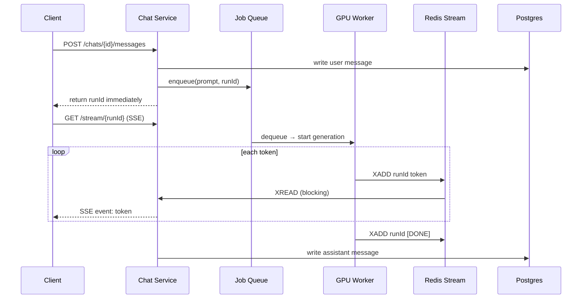

# System Design - ChatGPT

> Topics: Requirements → Core Entities → API → High Level Design (Send Prompt + Chat History) → Deep Dives (Streaming, GPU Scheduling, Fairness, Context Cost)

---

## Architecture Diagrams

### High-Level Architecture

```mermaid
flowchart LR
    Client -->|POST /chats/{id}/messages| APIGW[API Gateway]
    APIGW --> ChatService[Chat Service\nstateless]
    ChatService -->|read/write messages| Postgres[(Postgres\nChats + Messages)]
    ChatService -->|enqueue generation| Queue[Job Queue]
    Queue --> InferService[Inference Service\nGPU Workers]
    InferService -->|XADD tokens| Redis[(Redis Streams\nrunId stream)]
    Redis -->|XREAD tokens| ChatService
    ChatService -->|SSE stream| Client
```

### Streaming Flow（Token 传输路径）



### Reference Architecture

![[raw_material/tech/system-design/images/chatgpt.png]]

---

## 1. Requirements (~5 min)

ChatGPT 的系统设计核心矛盾在于：**LLM 推理是慢的、贵的、GPU 受限的**，而用户期望的是实时响应。需求澄清阶段最重要的是把"时间到第一个 Token Time-to-First-Token（TTFF）"和"GPU 容量约束"确立为核心非功能性需求——这两个约束会驱动后续所有 Deep Dive 决策。

### Functional Requirements

1. 用户发送 Prompt，收到 AI 生成的响应（Streaming 流式返回）
2. 用户可查看历史对话，续接已有对话（上下文 Context 跨轮次携带）

**Out of scope：**
- 编辑/分支历史消息
- 图片、音频、视频输入输出（仅文本）
- 多用户协作对话
- Custom GPTs、Function Calling、联网搜索

### Non-Functional Requirements

| Metric | Target |
|--------|--------|
| DAU | **200M** |
| Time-to-First-Token (TTFF) | **< 500ms** |
| 单次生成最长时间 | **~30 seconds** |
| 并发 In-flight Streams | **~120k** |
| 峰值 | **~20k prompts/sec** |
| Availability | **99.9%+**（对话状态优先可用性，非强一致性） |

> **定性结论：** 系统是 GPU-bound 的，不是 CPU/网络 bound 的。TTFF 要求 Streaming（不能等完整响应），高并发要求 GPU 调度和排队，长对话要求上下文成本控制。三个 NFR 对应三个 Deep Dive。

---

## 2. Core Entities (~2 min)

实体设计要早于 API 定义。关键点：`Generation` 是一个容易被遗漏的实体，在 HLD 阶段暂时不需要，但 Streaming 和 GPU 调度的 Deep Dive 都需要它——它是一次推理尝试的生命周期载体。

| Entity | Key Fields | 说明 |
|--------|-----------|------|
| **User** | userId, tier (free/paid) | Tier 决定 GPU 调度优先级 |
| **Chat** | chatId, userId, title, createdAt | 一个对话线程，属于一个用户 |
| **Message** | messageId, chatId, role (user/assistant), content, tokenCount | 对话的一轮，含 Token 计数用于计费 |
| **Generation** | runId, chatId, messageId, status (queued/streaming/done/failed/cancelled), model, inputTokens, outputTokens | 一次推理尝试；SSE reconnect 和取消操作都基于它 |

> `userId` 从不出现在请求 body 或 URL path 里——它从 JWT Session Token 中提取，服务端校验所有权。客户端传 userId 是经典安全红旗 Security Red Flag。

---

## 3. API / System Interface (~5 min)

API 设计的关键决策是**流式传输用 SSE 而非 WebSocket**：Token 生成是单向推送（服务端 → 客户端），SSE 足够，且比 WebSocket 实现更简单、支持 HTTP/2 多路复用、断线重连有原生支持。

| Endpoint | Method | Purpose | Key Design |
|----------|--------|---------|------------|
| `/chats` | POST | 创建新对话 | 返回 chatId |
| `/chats/{chatId}/messages` | POST | 发送 Prompt，获取响应 | 响应用 **SSE 流式传输**；立即返回 runId，客户端用 runId 订阅 stream |
| `/chats` | GET | 获取用户对话列表 | Cursor Pagination，支持侧边栏加载 |
| `/chats/{chatId}/messages` | GET | 获取单个对话的消息列表 | Cursor Pagination，长对话不一次性加载 |
| `/chats/{chatId}/runs/{runId}/cancel` | POST | 取消正在生成的响应 | 显式取消信号，释放 GPU；关闭浏览器 Tab ≠ 取消 |

> **为什么选 SSE 不选 WebSocket？**
> Token 生成是单向的（server → client），WebSocket 是双向的，引入了不必要的复杂度。SSE 基于 HTTP，天然支持负载均衡器 Load Balancer 和代理 Proxy，断线重连 Reconnect 有标准的 `Last-Event-ID` 机制。

---

## 4. High Level Design (~10-15 min)

### 发送 Prompt & 接收响应

HLD 的起点是一个**故意简单的同步设计**，明确指出它的问题，再在 Deep Dive 里修复。先让系统"跑起来"，再解决性能问题。

```
Client → API Gateway（认证 + 限流）
       → Chat Service（无状态，水平扩展）
           → 写 user message → Postgres
           → 同步调用 Inference Service（GPU Worker）
           → 等待完整响应（最长30秒！）
           → 写 assistant message → Postgres
           → 返回给 Client
```

| 组件 | 职责 | 扩展方式 |
|------|------|---------|
| **API Gateway** | 认证、限流、路由 | 水平扩展 Horizontal Scaling |
| **Chat Service** | 消息持久化、调用推理、上下文组装 | 无状态，水平扩展 |
| **Postgres** | 持久化 Chats + Messages | 读写分离 Read Replica，按 userId 分片 |
| **Inference Service** | GPU Worker 运行 LLM | GPU 受限，需独立扩展 + 调度 |

**关键设计决策：** Chat Service 和 Inference Service 分离部署。Chat Service 是廉价的 CPU 服务，可以任意扩展；Inference Service 是昂贵的 GPU 服务，需要独立调度。两者分离是后续所有 Deep Dive 的基础。

**已知问题（HLD 阶段承认，Deep Dive 修复）：**
1. 同步等待最长 30 秒 → 用 SSE + Redis Streams 修复（Deep Dive 1）
2. 无 GPU 调度准入控制 Admission Control → 用 Job Queue + 连续批处理修复（Deep Dive 2）
3. 长对话每轮重发全部历史 → 用摘要 Summarization + 前缀缓存 Prefix Caching 修复（Deep Dive 4）

### 查看历史 & 续接对话（Context Carry-over）

不需要新服务，只需在 Chat Service 加上下文加载逻辑：

```
用户发送续接消息
→ Chat Service 查询该 chatId 的历史 messages（按 createdAt 排序）
→ 拼接历史消息（含 role: user/assistant）+ 新 Prompt
→ 组合 Prompt 发送给 Inference Service
→ 新 assistant message 写回 Postgres
```

**已知问题：** 每轮发送完整历史 → 输入 Token 数随对话增长线性增加 → 成本爆炸 + 超出 Context Window → Deep Dive 4 修复。

---

## 5. Deep Dives (~10 min)

### 5.1 Streaming：如何实现低 TTFF + 稳定流

**问题根源：** 同步 HTTP 让用户盯着空白屏幕最长30秒，违反 TTFF < 500ms 的 NFR。解法分两层：

**层1 — 传输层 Transport：SSE**

SSE（Server-Sent Events）让 Chat Service 把连接保持打开，服务端生成 Token 时立即 push 给客户端。用户看到第一个 Token 的时间从"等全部生成完"缩短到"生成第一个 Token"的时间，通常 < 500ms。

**层2 — 扇出层 Fanout：Redis Streams**

Chat Service 是水平扩展的无状态服务，任意一台实例都可能持有 SSE 连接。GPU Worker 生成的 Token 如何传到"碰巧持有这个连接的那台 Chat Service"？

解法：Redis Streams（每个 runId 一个 Stream）

```
GPU Worker 生成 Token → XADD runId stream
Chat Service 实例     → XREAD runId stream（blocking，阻塞等待）
                      → 把 token 写入 SSE 连接
```

**断线重连 Reconnect：**
- 客户端断线时，浏览器自动重连，携带 `Last-Event-ID`（上次收到的 entry ID）
- Chat Service 从该 ID 之后 XREAD，重放未收到的 Token，再继续实时流
- Redis Stream 作为持久化 Buffer，保证"断线不等于生成中断"

**Generation 实体的作用：**
- runId 是 Generation 的 ID
- status: `queued → streaming → done / failed / cancelled`
- 断线重连、取消、计费都基于 Generation 的 status

---

### 5.2 GPU 调度：如何高效利用稀缺 GPU

**为什么这个问题重要？**

前沿 LLM 太大，单张 GPU 放不下，需要一整个 GPU Box（8-16 张 GPU）用张量并行 Tensor Parallelism 或流水线并行 Pipeline Parallelism 分割权重。120k 并发流需要数万张 GPU，年均推理成本达数十亿美元（OpenAI 2024 年约 $1.8B）。每提升一个百分点的 GPU 利用率 GPU Utilization 都是真实节省。

**模式：Job Queue + Worker Pool（长任务模式 Long-Running Tasks Pattern）**

```
Chat Service → Job Queue（enqueue prompt + runId）
Job Queue    → GPU Worker（pull when capacity available）
GPU Worker   → 生成 Token → XADD Redis Stream
```

Queue 解耦了请求接收和 GPU 执行，不再同步等待。GPU 满时请求在 Queue 等待，不阻塞 Chat Service。

**连续批处理 Continuous Batching（关键优化）**

为什么 GPU 是 Memory-Bandwidth Bound 的？
- 每次生成 Token，GPU 需要把模型权重（数百 GB）从 HBM（High-Bandwidth Memory）流过计算单元
- 单个序列 Single Sequence：每次权重流只产生 1 个 Token → 带宽严重浪费
- 批处理 Batching：同一次权重流产生 N 个 Token（N 个并发序列各生成 1 个 Token）

**Static Batching 的问题：** 等批次里所有序列都完成才开始下一批，短序列等长序列 → GPU 空转。

**Continuous Batching（连续批处理）：** 序列完成时立即从 Queue 中拉入新序列，保持 GPU 持续满载。vLLM、TGI 等主流推理框架都实现了 Continuous Batching。

```mermaid
gantt
    title Continuous Batching vs Static Batching
    dateFormat X
    axisFormat %s

    section Static Batching
    Seq A (short) :done, 0, 3
    Seq B (long)  :done, 0, 8
    GPU idle      :crit, 3, 8
    Next batch    :active, 8, 12

    section Continuous Batching
    Seq A (short) :done, 0, 3
    Seq B (long)  :done, 0, 8
    Seq C (new)   :active, 3, 7
    Seq D (new)   :active, 7, 11
```



---

### 5.3 公平性与优先级：如何避免重度用户霸占 GPU

**问题：** Token 消耗极不均匀——一个发 30k Token Prompt 的用户占用的 GPU 算力比100个发一行消息的用户加起来还多。需要两层控制：

| 维度 | 问题 | 解法 |
|------|------|------|
| **用户间公平 Fairness** | 重度用户饿死其他用户 | Token-Aware Budget：每用户维护滑动窗口内的 Token 消耗，超限则 Queue 中降优先级 |
| **层级间优先 Tier Priority** | Paid 用户应该比 Free 用户体验更好 | Weighted Priority Queue：付费用户请求权重高，空闲 GPU 优先分配给付费用户；Free 流量在紧张时最先被降级 Degraded |

**关键设计：** 不能用简单的 Requests-Per-Minute 限流——一个 1 Token 的请求和一个 30k Token 的请求消耗完全不同。必须用 **Token-Aware Quota**（基于 Token 消耗量的配额）。

---

### 5.4 上下文成本控制：如何避免长对话费用失控

**问题：** 每轮对话重发完整历史 → 输入 Token 数线性增长 → 成本 + 延迟都随对话轮次线性增长，最终超出 Context Window 直接崩溃。

**解法 1：摘要压缩 Summarization**

当历史消息超过阈值（如 80% Context Window），用一次轻量 LLM 调用把历史压缩成摘要 Summary，替换掉原始历史消息：

```
[消息1...消息N-k] → Summarization → 摘要(200 tokens)
[摘要 + 消息N-k+1...消息N + 新 Prompt] → Inference
```

**权衡：** 摘要会丢失细节，用户可能发现 AI"忘记了"某些早期内容。但远比完全无法继续对话（超出 Context Window）好。

**解法 2：KV Cache 复用 / 前缀缓存 Prefix Caching**

LLM 推理的 Prefill 阶段（处理输入 Token）是计算密集的。如果对话历史没有变化，KV Cache（Attention 中间状态的缓存）可以复用上一轮的计算结果，只计算新增的 Token。

```
第 N 轮：[历史1...历史N] → 计算所有 → 存 KV Cache
第 N+1 轮：[历史1...历史N] → KV Cache 命中，跳过 → 只计算新 Prompt
```

vLLM 的 PagedAttention 实现了 KV Cache 的动态分配，显著降低长对话的推理延迟和成本。

| 方案 | 减少什么成本 | 代价 |
|------|------------|------|
| **Summarization** | 减少输入 Token 数量 | 丢失早期对话细节 |
| **Prefix Caching** | 减少重复计算（Prefill 阶段） | GPU 显存占用增加（存 KV Cache） |

---

### 5.5 取消与 GPU 回收 Cancellation

用户点击 Stop 时：

```
Client → POST /chats/{chatId}/runs/{runId}/cancel
Chat Service → 更新 Generation status = cancelled
             → Redis 发布取消信号（cancel channel keyed by runId）
GPU Worker  → 每个 Token Batch 间检查 cancel channel
             → 发现信号 → 立即停止生成，释放 GPU 资源
```

**为什么重要：** 一个被取消但仍在运行的 30 秒生成任务是纯粹的 GPU 浪费。立即回收 GPU 是真实的成本节省。

**关闭 Tab ≠ 取消：** SSE 断线不等于取消——用户可以重新打开 Tab，断线重连，继续收取 Token 流。取消必须是用户的显式操作，不能靠网络状态推断。

---

## Architecture Summary

```
[SEND PROMPT FLOW]
Client → API Gateway（auth + rate limit）
       → Chat Service（write user msg → Postgres）
       → Job Queue（enqueue prompt + runId）
       → 立即返回 runId
       
Client → SSE /stream/{runId}（连接任意 Chat Service 实例）
GPU Worker → XADD token → Redis Stream（per runId）
Chat Service → XREAD Redis Stream → SSE push → Client
GPU Worker → XADD [DONE] → Chat Service → write assistant msg → Postgres

[CONTEXT CARRY-OVER FLOW]
用户续接对话 → Chat Service 加载历史 messages
             → 拼接历史 + 新 Prompt
             → 检查 KV Cache 命中（Prefix Caching）
             → Inference Service 只计算新 Prompt 部分
             → 超限时触发 Summarization（压缩早期历史）

[KEY TECHNOLOGY CHOICES]
- 传输层:     SSE（单向推送，断线重连，Last-Event-ID）
- Token 扇出: Redis Streams（XADD/XREAD，per-runId stream）
- 持久化:     Postgres（Chats + Messages + Generations）
- GPU 调度:   Job Queue + Continuous Batching（vLLM/TGI）
- 公平性:     Token-Aware Budget + Weighted Priority Queue
- 上下文控制: Summarization + Prefix Caching（KV Cache 复用）
- 取消:       Redis cancel channel，Worker 轮询，立即释放 GPU

[NUMBERS]
200M DAU → 20k prompts/sec peak
120k concurrent streams → 数万张 GPU，~$1.8B/year 推理成本
30s max generation → 必须 Async + Queue，不能同步等待
TTFF < 500ms → 必须 Streaming（SSE），不能等全量响应
```

---

## Glossary

| 术语 | 一句话解释 |
|------|-----------|
| **TTFF (Time-to-First-Token)** | 用户提交 Prompt 到看到第一个 Token 的时间；核心延迟指标 |
| **SSE (Server-Sent Events)** | 服务端单向推送的 HTTP 长连接；适合 Token 流式传输 |
| **Redis Streams** | Redis 的持久化消息流；XADD 写入，XREAD 读取；用于 Token 扇出 Fanout |
| **Continuous Batching** | GPU Worker 序列完成时立刻补充新序列，保持 GPU 满载；vLLM/TGI 实现 |
| **Tensor Parallelism** | 前沿 LLM 权重太大，分割到多张 GPU 上并行计算 |
| **KV Cache / Prefix Caching** | 缓存 Attention 中间状态；相同前缀不重复计算，降低长对话推理成本 |
| **Admission Control** | 控制哪些请求被接受进入 GPU 队列；防止 GPU 过载 |
| **Generation** | 一次推理尝试的实体；携带 runId、status、token 计数 |
| **Token-Aware Quota** | 按 Token 消耗量计费的配额；比按请求数更公平 |
| **Speculative Decoding** | 小 Draft 模型猜测多个 Token，大模型一次 forward pass 验证；提升 TTFF 和吞吐 |
| **Summarization** | 超出 Context Window 时压缩历史对话；牺牲细节换可用性 |
| **Memory-Bandwidth Bound** | GPU 性能瓶颈在于权重从 HBM 流过计算单元的带宽，不在于算力 |

---

## Interview Tips

1. **先承认 HLD 的问题再修复。** 面试官想看到你能识别权衡 Trade-off，不是直接给出"完美"设计。同步 → 异步的演进比一开始就说"用 SSE + Redis"更有说服力。

2. **GPU 经济学是加分项。** 提到 "120k concurrent streams 意味着数万张 GPU，年均推理成本数十亿美元" 展示了 Staff 级别的系统视角——这是 Continuous Batching 和 Prefix Caching 存在的根本原因。

3. **SSE vs WebSocket 要能说清楚。** Token 生成是单向的，SSE 足够；WebSocket 引入双向复杂度，不合适。这个选择背后的原因比结论更重要。

4. **Fairness 和 Priority 是两个不同维度。** Fairness = 用户间公平（防止重度用户霸占），Priority = 层级间优先（Paid 优于 Free）。弱候选人把两者混为一谈。

5. **关闭 Tab ≠ 取消。** 这是一个反直觉的细节，能说清楚的候选人展示了对 SSE 断线重连机制的真实理解。
