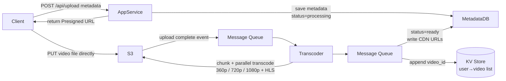
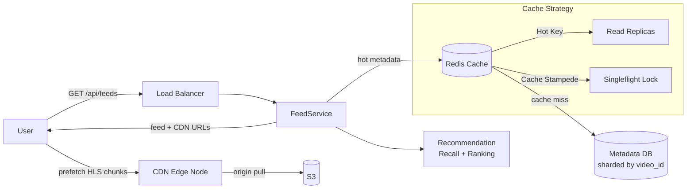
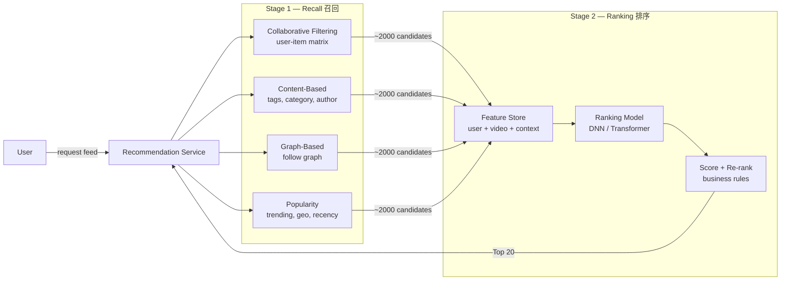
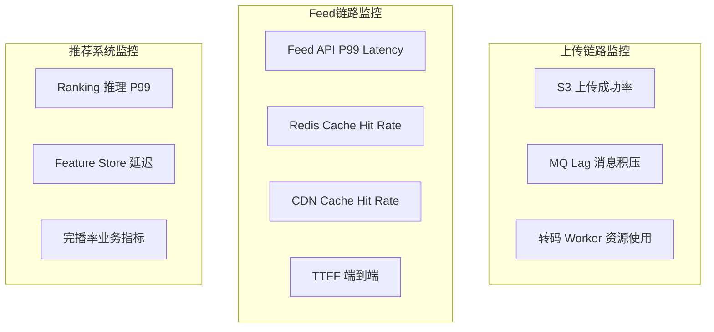

# System Design - TikTok / Douyin

> Topics: Requirements → Core Entities → API → High Level Design (Upload Pipeline + Feed Playback) → Deep Dives (DB sharding, streaming, caching, recommendation)

---

## Architecture Diagrams

### Upload Pipeline



### Feed Playback



---

## 1. Requirements (~5 min)

需求澄清是面试的第一步，目的是**主动缩小范围**，避免后面设计"万能系统"。功能性需求定义做什么，非功能性需求定义做到什么程度。抖音的关键约束是规模（5亿DAU）和延迟（2秒起播），这两个数字会直接驱动后续所有技术决策。

### Functional Requirements
- Upload video (max 500MB)
- Browse feed (infinite scroll, chronological for now)
- Watch video (playback starts within 2 seconds)
- Like / comment (lower priority)

### Non-Functional Requirements

| Metric | Target |
|--------|--------|
| DAU | **500M** |
| Playback start latency | **< 2 seconds** |
| Availability | **99.99%** |
| Read/Write ratio | **~1000:1** (read-heavy) |

> **定性结论：** 抖音是极度 read-heavy 的系统。架构重心在于用 Cache + CDN 扛读压力；写入链路用 async messaging 解耦，避免写入延迟影响读链路。99.99% 可用性意味着全年宕机时间不超过52分钟，必须 multi-AZ 部署。

---

## 2. Core Entities (~2 min)

先列出核心数据实体，明确每种数据**存在哪里、为什么**。关键判断：视频文件是二进制大文件，绝对不能存关系型数据库，必须用 Object Storage（S3）。用户的视频列表单独用 KV 存储做反范式 Denormalization，是为了避免跨分片聚合查询 Scatter-Gather。

| Entity | Storage | 原因 |
|--------|---------|------|
| **Video Metadata** | Relational DB (sharded) | 结构化字段，需要查询和过滤 |
| **Video File** | Object storage (S3) | 二进制大文件，不适合存数据库 |
| **User** | Relational DB | 结构化，需要关联查询 |
| **User → Video list** | KV store (Redis / DynamoDB) | 反范式，O(1) 查用户所有视频，避免跨分片扫表 |

**Video Metadata key fields:** `video_id`, `user_id`, `title`, `category`, `location`, `created_at`, `status` (processing/ready), `url_360p`, `url_720p`, `url_1080p`

---

## 3. API / System Interface (~5 min)

API 设计的核心决策有两个：1）上传走 **Presigned URL**，让客户端直传 S3，完全绕过 App Server，节省带宽和计算资源；2）Feed API 返回的每个条目必须包含可直接播放的 CDN Streaming URL，这样客户端拿到响应就能立刻开始预加载，不需要额外的 round trip。

| Endpoint | Purpose | Key Design |
|----------|---------|------------|
| `POST /api/upload` | 上传请求，携带 metadata | 返回 **Presigned URL** — 客户端直传 S3，不经过 App Server |
| `PUT /{presignedURL}` | 客户端直接上传视频文件到 S3 | 完全绕过业务服务器，节省带宽和计算 |
| `GET /api/feeds?cursor=&limit=` | 分页拉取 Feed | 返回 metadata + **直接可播放的 CDN Streaming URL** — 客户端无需额外请求即可预加载 |

> **关键设计：** Feed response 里每个条目必须包含可直接播放的 streaming URL。如果只返回 video_id，客户端还需要再发一次请求换取播放链接，这会造成额外延迟，破坏"2秒起播"的目标。

---

## 4. High Level Design (~10-15 min)

### Upload Pipeline

上传流程的核心设计思路是**异步解耦 Async Decoupling**。视频转码是分钟级耗时操作，如果同步处理会阻塞整个上传接口；用 Message Queue 解耦后，App Server 只需保存 metadata 并返回 Presigned URL，后续所有重活（转码、更新状态、更新 KV）全部异步完成。Presigned URL 让客户端直传 S3，App Server 完全不在上传数据路径上，省掉了大量带宽。

```
Client → API Gateway → App Service
    → Save metadata (status=processing)
    → Return Presigned URL

Client → S3 (direct upload, bypasses app server)
    → S3 upload complete event → Message Queue
    → Transcoding Service (chunk video, parallel transcode: 360p/720p/1080p + HLS)
    → Transcoded files → S3
    → Message Queue → Metadata Update Service (status=ready, write CDN URLs)
    → Message Queue → KV Update Service (append video_id to user's list)
```

| Step | Component | Note |
|------|-----------|------|
| 1 | Client → App Service | 保存 metadata（status=processing），返回 Presigned URL |
| 2 | Client → S3 | 直传，App Server 不在数据路径上 |
| 3 | S3 → MQ | S3 上传完成事件触发消息 |
| 4 | Transcoding Service | 视频切 chunk → **并行转码**多种格式 + HLS |
| 5 | Transcoded → S3 | 转码结果写回 S3 |
| 6 | MQ → Metadata Service | 更新 status=ready，写入各画质 URL |
| 7 | MQ → KV Service | 将 video_id 追加到用户视频列表 |

**Q: 转码要几分钟，用户能马上看到自己的视频吗？**
不能。status=processing 期间对其他用户不可见。**分块并行转码 Chunked Parallel Transcoding**（把大文件切成几十个 chunk，多个 worker 同时处理）可以大幅缩短等待时间，但无法做到实时。

**Q: 为什么用 MQ 而不是同步调用触发转码？**
转码是分钟级耗时操作。同步等待会阻塞上传接口，用户体验极差。MQ 解耦后：上传接口立即返回；转码失败可重试；消息天然幂等 Idempotent，不会重复处理。

### Feed Playback

Feed 播放链路的核心是**多层缓存 Multi-Layer Caching**。5亿 DAU 持续刷 Feed，数据库根本扛不住直接查询压力。热门视频的 metadata 用 Redis 缓存，视频文件本体用 CDN 分发到全球边缘节点，让用户从最近的节点取数据。个性化 Feed 每人不同、实时变化，不适合缓存——缓存的是 metadata，不是 Feed 本身。

```
User opens TikTok
    → API Gateway / Load Balancer
    → Feed Service（查询 Recommendation System）
    → Redis cache（热门视频 metadata）
    → DB（cache miss 时回源）
    → 返回 Feed 列表（含 CDN Streaming URL）
    → 客户端从最近 CDN 节点预加载 HLS chunk
```

---

## 5. Deep Dives (~10 min)

### 5.1 Database Design & Sharding

分片键的选择决定了数据分布是否均匀，是防止热点的核心决策。选错分片键，再好的 DB 架构也会被热点分片拖垮。

**为什么用 video_id 哈希分片而不是 user_id 或 created_at？**
- `user_id` 分片：头部创作者（百万粉）的视频全压在同一分片 → 热点
- `created_at` 分片：当前时间窗口的写入全压在最新分片 → 时间热点
- `video_id` 哈希分片：负载最均匀，没有天然热点，是正确答案

**为什么需要单独的 KV 存储用户视频列表？**
按 video_id 分片后，同一用户的视频散落在所有分片。用户打开个人主页时，如果去各分片聚合查询，代价极高（需要 Scatter-Gather 查询所有分片再 merge）。用 KV 单独维护 `user_id → [video_id list]` 是**反范式 Denormalization** 的经典应用：写入时多付一次代价（更新两处），换取查询时 O(1) 的高效。

| 问题 | 答案 | 关键词 |
|------|------|--------|
| 10亿视频 metadata 用什么分片键？ | **Hash on video_id** — 最均匀。user_id → 热门博主热点；created_at → 时间热点 | Hash sharding = 均匀分布，避免热点 |
| 用户个人主页如何聚合视频？ | 独立 **KV store**：`user_id → [video_id list]`，O(1) 查询 | Denormalization = 用写入代价换查询效率 |
| metadata DB 写入 + KV 更新如何保证一致性？ | 业务接受**最终一致性**（视频上传几秒后才出现在主页，用户可接受）。MQ 异步更新 KV：比轮询更实时，天然支持重试和幂等 | Eventual consistency > 强事务（业务允许时） |

### 5.2 Video Streaming Optimization (< 2s Playback)

视频"2秒起播"的目标靠多项技术叠加实现，每一层解决不同的延迟来源：HLS 解决"等整个文件下载"的问题，CDN 解决"跨地域传输延迟"的问题，ABR 解决"网络波动导致卡顿"的问题，Prefetching 解决"用户已经在看，下一个视频还没开始加载"的问题。

| Technique | 原理 |
|-----------|------|
| **HLS chunking** | 视频切成小 chunk（2–10秒），边下边播，不需等完整文件下载 |
| **CDN edge caching** | chunk 缓存到离用户最近的边缘节点，GeoDNS 路由，消除跨地域延迟 |
| **Adaptive Bitrate (ABR)** | 客户端实时检测网速，动态切换 360p/720p/1080p，网络差时降码率保流畅 |
| **Prefetching** | 看第 N 个视频时，后台已开始下载第 N+1、N+2 的前几个 chunk |
| **Feed prefetch trigger** | 用户刷到列表过半，立刻请求下一批 Feed（含 streaming URL），保证无限滚动不卡顿 |

> **权衡：** Prefetching 的代价是带宽浪费——预测错的视频白下载。对行为规律强的用户（固定时间看固定类型）效益高；对行为随机的用户收益低。大规模系统需要根据用户行为规律动态调整预取策略。

### 5.3 Caching Strategy

缓存策略的核心是"**缓存什么、不缓存什么**"。热门视频的 metadata 适合缓存（高频读、低频改）；个性化 Feed 不适合缓存（每人不同、实时变化）。缓存带来两个经典问题：Cache Stampede（缓存击穿）和 Hot Key，需要分别处理。

**Cache Stampede（缓存击穿）：** 热门视频的缓存 key 在同一时刻失效，几百万请求同时穿透到 DB。解法是 **Request Coalescing / Singleflight**：只允许一个请求去 DB 重建缓存，其余请求等待同一结果。比 Circuit Breaker 熔断更轻量直接——熔断 Circuit Breaking 是保护手段，单飞 Singleflight 是根本解法。

**Hot Key：** 病毒视频造成 Redis 某个分片流量暴增。解法是为该 key 增加**读副本 Read Replicas**，把读流量分散到多个副本。

| 场景 | 问题 | 解法 |
|------|------|------|
| 5亿 DAU 持续刷 Feed | DB 过载 | **Redis cache** 缓存热门视频 metadata；个性化 Feed 不缓存 |
| 用户在纽约，视频在北京 S3 | 高延迟 | **CDN** — GeoDNS 路由到最近边缘节点 |
| 病毒视频缓存失效 → 百万请求冲 DB | **Cache Stampede** (缓存击穿) | **Request Coalescing (singleflight)** — 一个请求去 DB，其余等结果 |
| 病毒视频造成 Redis **Hot Key** | 单分片过载 | 为该 key 增加 **Read Replicas**，读流量分散到多个副本 |

### 5.4 Recommendation System

#### 信号（Signals）

推荐系统的核心是"知道用户真正喜欢什么"。信号分两类：**显式信号 Explicit Signal**（用户主动操作）和**隐式信号 Implicit Signal**（用户下意识行为）。隐式信号更难伪造，也更准确——一个用户可能随手点赞，但不会无聊地把一个视频看三遍。

| 类型 | 例子 | 准确性 |
|------|------|--------|
| **显式** | 点赞、评论、分享、关注 | 意图明确，但可能随意操作 |
| **隐式** | 观看时长、**完播率**、跳过、刷新频率 | **更准确** — 下意识行为，难以伪造 |

> **核心指标是完播率（Completion Rate），不是点赞数。** 看了三遍不点赞，远比点了赞只看三秒更有价值。这是抖音推荐系统区别于传统内容平台的关键设计决策。

---

#### 两阶段流水线（Two-Stage Pipeline）

推荐系统面临的核心矛盾：**精度和速度不可兼得**。用复杂模型对100亿视频逐一打分，实时计算根本不可能完成。解法是分两阶段——先用简单规则快速粗筛，再用复杂模型精细排序。



| 阶段             | 目标             | 方法                     | 延迟要求    |
| -------------- | -------------- | ---------------------- | ------- |
| **召回 Recall**  | 100亿 → ~2000候选 | CF、内容相似、关注图、热度         | < 50ms  |
| **排序 Ranking** | 2000 → Top 20  | DNN / Transformer，全量特征 | < 100ms |

---

#### 召回方法详解（Recall Methods）

召回阶段有四条并行通道，各自独立运行，最后合并去重。每条通道解决不同的信息获取角度，互相补充。

**协同过滤（Collaborative Filtering）**
"和你行为相似的用户喜欢的内容，你可能也喜欢。"通过用户-视频交互矩阵分解（ALS、Matrix Factorization）找到相似用户群，再取他们高评分视频。优点是能发现跨品类的隐藏兴趣；缺点是冷启动完全失效——新用户没有历史，新视频没有播放数据，矩阵里根本找不到。

**内容相似（Content-Based）**
根据视频的标签、类别、语言、时长与用户历史匹配。新视频上传后立刻可以参与召回（不需要等播放数据积累），所以是冷启动场景的主要兜底手段。缺点是容易强化信息茧房——用户永远只看到自己已知兴趣范围内的内容。

**关注图（Graph-Based）**
从用户的关注关系出发，把关注账号的新视频、以及"关注你关注的人的用户"也喜欢的视频纳入候选。社交信号强，对创作者友好。缺点是关注数少的用户图稀疏，召回结果有限。

**热度/趋势（Popularity）**
按地域、时间窗口、类别筛选当前热门视频。任何用户都适用，是最安全的兜底通道。个性化程度最低，但保证召回不为空。

**候选合并：** 四路并行运行，结果合并去重后送入排序。典型权重：CF 40%、内容 30%、关注图 20%、热度 10%。

| 方法 | 核心逻辑 | 优势 | 弱点 |
|------|---------|------|------|
| **Collaborative Filtering** | 相似用户的喜好 | 发现跨品类兴趣 | 冷启动失效 |
| **Content-Based** | 视频标签与历史匹配 | 新视频立即可用 | 信息茧房风险 |
| **Graph-Based** | 关注图社交信号 | 创作者生态友好 | 稀疏用户效果差 |
| **Popularity** | 地域+时间热门 | 冷启动兜底 | 个性化弱 |

---

#### 排序模型详解（Ranking Model）

排序阶段的任务是对2000个候选逐一预测"这个用户看完这个视频的概率"，取Top 20返回。

**输入特征分四组：**

| 特征组 | 例子 |
|--------|------|
| **用户特征** | 年龄、性别、地区、设备、历史品类偏好、平均观看时长 |
| **视频特征** | 时长、类别、标签、创作者粉丝数、视频发布时间、聚合完播率 |
| **上下文特征** | 当前时间、星期几、网络类型（WiFi vs 4G）、本次会话深度 |
| **交互特征** | 用户是否见过该创作者？上次看完后有没有关注？ |

**模型结构：** 深度神经网络 DNN，稀疏类别特征 Sparse Categorical Features（如视频ID、用户ID）通过 Embedding 层压缩成稠密向量 Dense Vector，再拼接数值特征送入全连接层 Fully-Connected Layer。输出：该(用户, 视频)对的预测完播率 Predicted Completion Rate。

**模型打分完成后，还需要业务规则二次调整 Re-ranking：**
- 去重 Deduplication：相邻两条不能来自同一创作者
- 新鲜度加权 Freshness Boost：发布时间 < 24h 的视频轻微加分
- 安全过滤 Safety Filter：移除被标记的内容
- 探索注入 Exploration Injection：强制替换 1–2 个槽位为用户画像 User Profile 外的视频

---

#### 冷启动（Cold Start）

冷启动是推荐系统最难的工程问题之一，需要对"新用户"和"新视频"分别处理。

**新用户：** 没有历史数据，协同过滤和内容匹配都失效。解法是注册时让用户选择3–5个兴趣标签（主动收集信号），同时用地理位置+热门内容兜底。只需要积累10次左右的真实交互，个性化模型就能开始工作。

**新视频：** 没有播放数据，无法计算完播率。解法是先用内容标签 Content-Based 纳入候选，同时做"小流量曝光实验 Small-Scale Exposure Test"：把视频推给1000个随机用户，测量真实完播率，根据结果决定是大规模推广还是抑制分发。这相当于一个轻量级 A/B 测试，是新视频冷启动 Cold Start 的标准做法。

| 场景 | 问题 | 解法 |
|------|------|------|
| **新用户** | 无历史 → CF和内容匹配双失效 | 注册时选兴趣标签；地理+热门兜底；10次交互后开始个性化 |
| **新视频** | 无播放数据 → 完播率无法计算 | 内容标签先进候选；小流量曝光测真实完播率；再决定是否推广 |

---

#### Feature Store 与训练流水线

推荐系统的特征计算分离线和在线两条路，分别处理不同时效要求的特征。

```
[离线 — 批处理]
用户行为事件（Kafka）→ Spark 聚合 → Feature Store（Redis / Cassandra）
训练日志 → 模型训练（GPU 集群，每日） → Model Registry

[在线 — 实时]
请求到达 → Feature Store 查询（用户+视频特征，< 5ms）
         → Ranking 模型推理（< 50ms，GPU Serving）
         → Re-ranking → 返回 Top K
```

- **Feature Store：** 用户 Embedding 每几小时更新一次；视频 Embedding 在上传时生成，定期刷新
- **模型服务：** GPU 推理集群，gRPC 接口；模型每日离线更新，可叠加近实时 Fine-tuning
- **日志闭环：** 每次曝光、跳过、观看时长都写入 Kafka，驱动下一轮训练

---

#### 探索 vs 利用（Exploration vs Exploitation）

纯粹的"利用"策略会导致推荐系统退化——用户的兴趣模型越来越窄，最终陷入信息茧房，降低长期留存。需要主动引入探索。

**ε-greedy：** 最简单的方案。以概率 ε（通常5–10%）随机选一个候选替换掉排名最高的，其余按模型排序。实现简单，但探索是盲目的，不区分"值得探索"和"随机噪声"。

**Thompson Sampling / UCB：** 贝叶斯 Bayesian 多臂老虎机 Multi-Armed Bandit 方法。对每个候选视频维护一个"预期回报的不确定性估计 Uncertainty Estimate"，优先探索那些不确定性高的内容（可能是潜力股，也可能是垃圾，但值得一试）。随着数据积累，不确定性下降，探索自然收敛——比 ε-greedy 更有原则。

| 策略 | 做法 | 效果 |
|------|------|------|
| **Exploitation** | 只推已知喜好 | 短期CTR高 → 长期信息茧房 |
| **Exploration** | 保留1–2个槽位给画像外视频 | 发现新兴趣，提升长期留存 |
| **ε-greedy** | 概率 ε 随机替换 | 简单；探索是盲目的 |
| **Thompson Sampling / UCB** | 优先探索不确定性高的候选 | 更有原则；随数据积累自然收敛 |

---

#### A/B 测试与指标

推荐系统的每次模型迭代都必须通过 A/B 测试验证效果，不能凭直觉上线。

- 每次 Ranking 模型变更 → 切 1–5% 流量做 A/B 测试
- **主指标 Primary Metric：** 完播率、单次会话时长、D7 留存率
- **护栏指标 Guardrail Metric：** DAU、人均使用时长不能低于基线（防止"局部优化，全局变差"）
- **Novelty Effect 陷阱：** 新推荐策略上线初期往往会出现短暂的指标提升（用户对新内容感到新鲜），但这不代表真实效果。测试周期至少持续2周，确认提升是持续的而非新鲜感驱动的。

---

### 5.5 SRE & Operations Deep Dive

这是系统设计面试中常被忽视但对 EM/TLM 岗位极重要的一节。设计一个系统是一回事，在生产环境中长期稳定地运维它是另一回事。抖音这样的系统规模，任何组件出问题都可能影响数亿用户，SRE 的挑战在于：**如何在复杂的分布式链路中快速定位故障，以及如何提前预防故障**。

---

#### 核心 SLO / SLI 设计

SRE 的第一步是定义清楚"什么叫正常"。SLO（Service Level Objective）是对用户的承诺，SLI（Service Level Indicator）是衡量承诺是否达成的指标。

| 服务 | SLI | SLO 目标 |
|------|-----|---------|
| Feed API | P99 latency | < 300ms |
| 视频起播 | Time to First Frame (TTFF) | < 2s (P95) |
| 上传成功率 | 上传请求成功完成率 | > 99.9% |
| 转码完成时间 | 上传后 metadata status=ready 的时间 | < 5 分钟 (P95) |
| 整体可用性 | 成功请求 / 总请求 | > 99.99% |

**Error Budget：** 99.99% 可用性 = 每月约 4.4 分钟宕机时间 Downtime。Error Budget 消耗过快时，自动冻结非紧急发布 Feature Freeze，优先稳定性。

---

#### 关键监控指标（What to Monitor）

抖音系统分三条核心链路，每条链路有不同的关键指标：

**上传链路**
- S3 上传成功率、P99 上传延迟
- MQ 消息积压量 Consumer Lag — 积压增长 = 转码服务处理能力不足
- 转码 Worker CPU / 内存使用率
- status=processing 视频的平均等待时间

**Feed 播放链路**
- Feed API P50/P95/P99 latency
- Redis cache hit rate（目标 > 99%；下降 = DB 压力上升）
- CDN cache hit rate（目标 > 95%；下降 = Origin Pull 回源压力暴增）
- DB 查询 QPS 和 P99 latency（Redis miss 时的最后防线）
- Time to First Frame（TTFF）端到端指标

**推荐系统**
- Ranking 模型推理 P99 latency（< 100ms）
- Feature Store 查询延迟
- 推荐结果完播率（业务指标，间接反映推荐质量）
- Model serving GPU 利用率



---

#### Cloud 特有的挑战

在 Cloud（AWS / GCP）上运维这样的系统，有几个平台特有的坑：

**S3 / Object Storage**
- S3 本身高可用，但 **Presigned URL 有过期时间**。客户端网络差、上传慢，URL 过期后上传失败——需要客户端检测到过期后重新请求 URL（不要直接报错）。
- S3 `us-east-1` 是单 region，跨 region 上传延迟高。全球用户应该就近上传到离自己最近的 region，再异步 cross-region replication 到主 region。
- S3 请求限流（Throttling）：单个 prefix 有 TPS 限制（3500 PUT/5500 GET）。视频文件路径设计时要注意打散 prefix（比如用 video_id 的 hash prefix 而不是用日期前缀，否则同一天的所有上传都压在一个 prefix）。

**CDN**
- CDN cache purge（缓存失效）有延迟，最慢需要几分钟才能全球生效。视频被举报需要紧急下架时，单靠 purge 不够快——需要在 App Server 层加一个"黑名单"检查，在 CDN 缓存失效前拦截请求。
- CDN 边缘节点故障：自动 failover 到下一个节点，但 GeoDNS TTL 决定了用户感知到切换的时间。TTL 设置太长 → 故障切换慢；太短 → DNS 查询压力大。

**Kubernetes / 容器化**
- 转码 Worker 是 CPU 密集型，需要单独部署（不能和 API 服务混跑），用 HPA（Horizontal Pod Autoscaler）根据 MQ Lag 自动扩缩容。
- 视频文件不能挂载 PVC，转码时用 emptyDir 临时存储（内存或 NVMe 磁盘），转码完成后写 S3，Pod 删掉不留垃圾。
- 推荐系统 Ranking 模型需要 GPU 节点，用独立的 Node Pool + GPU Toleration，避免和 CPU 工作负载抢资源。

**数据库**
- 分片后跨分片事务不可用。上传流程中 metadata DB 写入 + KV 更新是两个独立操作，依赖 MQ 保证最终一致性，不能用分布式事务（性能代价太高）。
- Read Replica 延迟（Replication Lag）：主库写入后，副本可能几十毫秒到几秒才能反映最新数据。Feed 读操作可以接受读副本（最终一致性没问题）；上传后立刻查"自己的视频"需要读主库（或者接受几秒延迟）。

---

#### Incident 排查 Playbook

**场景1：Feed 延迟突增（P99 > 1s）**

```
1. 看 Dashboard
   - Redis cache hit rate 下降？→ 缓存击穿，查 Cache Stampede
   - CDN cache hit rate 下降？→ origin 回源暴增，查 CDN 日志
   - DB query P99 上升？→ 慢查询或分片热点，查 slow query log

2. 定位层级
   - curl Feed API，加 X-Request-Id header，追踪 trace
   - 检查 Redis：redis-cli --latency / info stats
   - 检查 DB 连接池是否满（connection pool exhausted）

3. 常见根因
   - 热门事件（节日、突发新闻）→ 特定类别视频请求暴增 → Redis Hot Key
   - 大规模部署后 Redis 缓存被刷新 → Cache Stampede
   - DB Shard 数据分布不均 → 热点分片（用 video_id hash 可避免）

4. 止血
   - Hot Key → 手动增加该 key 的 Redis replica
   - Cache Stampede → 临时扩 DB read replica，等缓存重建
   - 热点分片 → 限流 + 降级（返回缓存的旧 Feed）
```

**场景2：视频上传成功但长时间看不到（status 卡在 processing）**

```
1. 检查 MQ 积压
   - Kafka / SQS consumer lag 暴增？→ 转码 Worker 处理能力不足
   - 消息 DLQ（Dead Letter Queue）有消息？→ 转码失败，查 Worker 日志

2. 检查转码 Worker
   - Pod 是否 OOMKilled？→ 内存不足，大视频文件吃内存
   - CPU throttling？→ resource limit 设置太低
   - Worker 数量是否够？→ HPA 有没有触发扩容

3. 检查 S3 事件通知
   - S3 → MQ 的事件通知是否正常触发？
   - 用 CloudWatch / GCS logs 验证事件是否发出

4. 根因与修复
   - MQ 积压 → 手动扩 Worker 副本数（kubectl scale）
   - 大视频 OOM → 调整转码 chunk size，减小单个 chunk 内存占用
   - 转码失败重试 → 检查 DLQ，修复后 redrive 消息
```

**场景3：推荐系统返回变差（用户反映内容重复 / 不相关）**

```
1. 检查模型服务
   - Ranking 模型是否用了旧版本？（Model Registry 版本对比）
   - Feature Store 数据是否陈旧？（用户 Embedding 更新时间）

2. 检查 A/B 实验
   - 有没有正在运行的实验把部分用户切到了测试策略？
   - 测试策略是否有 bug？

3. 检查信号管道
   - Kafka 用户行为日志是否有延迟或丢失？
   - 完播率计算是否异常（客户端事件上报问题）？

4. 止血
   - 回滚 Ranking 模型到上一个稳定版本
   - 关闭异常 A/B 实验
   - 降级到基于 Popularity 的召回（最稳定的 fallback）
```

---

#### On-Call Runbook 设计原则

好的 Runbook 应该让一个刚加入团队3个月的工程师也能独立处理 P1 incident，不需要打电话叫醒 senior。

- **每个 Alert 对应一个 Runbook**：告警触发时，直接链接到对应的排查步骤
- **Runbook 包含**：症状描述、影响范围估算、排查步骤（有序）、常见根因、止血操作、升级标准
- **定期演练（Game Day）**：每季度人工注入故障（Chaos Engineering），验证 Runbook 是否有效、On-Call 工程师是否熟悉
- **Post-Mortem 文化**：每次 P1/P2 incident 必须写 blameless post-mortem，重点是系统改进而非追责

---

#### 容量规划（Capacity Planning）

抖音的规模决定了容量规划不能靠"发现慢了再加机器"——需要提前预测。

**关键估算：**
- 5亿 DAU，人均刷 Feed 30分钟 → 每天约 15亿视频播放请求
- 1000:1 读写比 → 每天约 150万新视频上传
- 平均视频 50MB，150万 × 50MB = **75TB/天** 新增存储
- 转码后多格式 × 3 → 实际存储约 **225TB/天**

**云上容量策略：**
- 视频存储用 S3 Intelligent-Tiering（热数据留 Standard，冷数据自动降级 Glacier）
- 转码 Worker 用 Spot Instance（可中断，但转码任务有 checkpoint，中断后续传）
- CDN 容量跟着 DAU 增长自动扩展，但需要提前和 CDN 厂商签 committed use 合同降低成本
- DB 分片数量规划：按未来3年数据量预估，提前超量分片（分片迁移代价极高，宁可早期过度分片）

```
[UPLOAD FLOW]
User → API Gateway → App Service (save metadata, return Presigned URL)
     → Direct to S3 → MQ → Transcoding (chunked parallel, multi-res HLS)
     → Metadata DB (status=ready) + KV (user video list)

[FEED PLAYBACK FLOW]
User → API Gateway → Recommendation (Recall + Ranking, Top K)
     → Redis (hot metadata, Hot Key → read replicas)
     → Return feed (with CDN Streaming URLs)
     → Client prefetches HLS chunks → ABR playback

[KEY TECHNOLOGY CHOICES]
- Video storage:    S3 (object storage) + CDN (GeoDNS distribution)
- Metadata:         Relational DB + video_id hash sharding + read replicas
- User video list:  KV store (denormalized, eventual consistency via MQ)
- Cache:            Redis (hot metadata, singleflight to prevent stampede)
- Transcoding:      MQ-triggered, chunked parallel async processing
- Recommendation:   Recall (rule-based) + Ranking (ML, completion rate as core signal)

[NUMBERS]
500M DAU → sharding + Redis + CDN required
10B videos → video_id hash sharding to avoid hotspots
99.99% availability → multi-AZ + DB replicas + CDN redundancy
```

---

## Glossary

| Term | One-line explanation |
|------|---------------------|
| **Presigned URL** | Temporary signed URL issued by server; client uploads directly to S3, bypassing app server |
| **HLS** | HTTP Live Streaming — video split into small chunks, stream while downloading |
| **ABR** | Adaptive Bitrate — dynamically switch video resolution based on real-time bandwidth |
| **Prefetching** | Pre-download content the user is likely to watch next into CDN or client cache |
| **Transcoding** | Convert raw video into multiple formats and resolutions (360p/720p/1080p + HLS) |
| **Denormalization** | Redundantly store data (e.g. KV for user video list) — trade write cost for read efficiency |
| **Request Coalescing / Singleflight** | Multiple concurrent requests → only one goes to DB, rest wait for same result |
| **Cache Stampede** | Cached entry expires → massive concurrent requests hit DB simultaneously |
| **Hot Key** | Single Redis key receives disproportionate traffic → shard overloaded |
| **Recall** | Recommendation stage 1: coarse-filter 10B videos to thousands of candidates |
| **Ranking** | Recommendation stage 2: score candidates with ML model, return Top K |
| **Completion Rate** | % of video watched — most important implicit signal in TikTok's recommendation system |
| **Filter Bubble** | User only sees content matching known preferences → narrowing worldview |

---

## Interview Habits (Anti-patterns to Avoid)

1. **Anchor every decision to a number.** Don't say "we need sharding." Say "500M DAU + 10B videos exceeds single-node capacity → hash shard on video_id."

2. **Cover non-functional requirements at close.** Summarize how 99.99% availability is achieved: multi-AZ, DB replicas, CDN redundancy.

3. **Give the full Cache Stampede answer.** If you mention Circuit Breaker, also mention Request Coalescing (singleflight) — one goroutine/thread hits DB, rest wait — lighter weight and more direct