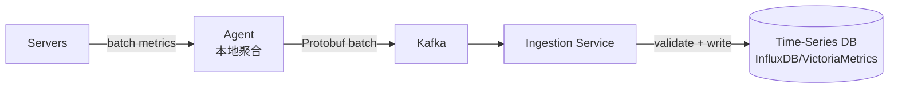

# System Design - Metrics Monitoring Platform

> Topics: Requirements → Core Entities → Data Flow → API → High Level Design (Ingest + Query + Alert + Notify) → Deep Dives (Query performance, Alert latency, HA, Cardinality)

---

## Architecture Diagram

![[raw_material/tech/system-design/images/monitoring.png]]

---

## 1. Requirements (~5 min)

Metrics Monitoring 系统设计的核心矛盾是**规模与实时性的冲突**：5亿次/秒的写入压力要求高吞吐、低延迟的写入路径；同时 Dashboard 查询要跨越数天或数周的数据，要求快速的读聚合能力。两个方向的需求在架构上几乎完全冲突——这正是需求澄清阶段需要明确的。

参考系统：Datadog、Prometheus + Grafana、AWS CloudWatch。

### Functional Requirements

1. 从服务器和服务采集指标（CPU、内存、延迟、自定义计数器）
2. 用户可在 Dashboard 上查询和可视化指标（支持过滤、聚合、时间范围）
3. 用户可定义告警规则 Alert Rule（时间窗口 + 阈值，如"p99 延迟 > 500ms 持续5分钟"）
4. 规则触发时推送通知（邮件、Slack、PagerDuty）

**Out of scope：** 日志聚合 Log Aggregation、分布式追踪 Distributed Tracing、ML 异常检测 Anomaly Detection

### Non-Functional Requirements

| Metric | Target |
|--------|--------|
| 服务器规模 | **500k 台服务器** |
| 写入吞吐 | **5M metrics/sec**（每台服务器每10秒100个数据点）|
| 原始数据量 | **~1GB/sec**（每个数据点 100-200 bytes）|
| Dashboard 查询延迟 | **秒级**（跨天/跨周查询）|
| 告警延迟 | **< 1 分钟**（从指标产生到告警触发）|
| 可用性 | **高可用**；Dashboard 可最终一致，Alert 必须可靠 |
| 乱序数据 | 支持网络延迟导致的**乱序 Out-of-Order 数据** |

> **定性结论：** 写入路径（Ingest）是**吞吐优先**，必须用 Queue + 批处理解耦；读路径（Query）是**延迟优先**，需要专用的 Time-Series Database + 预聚合 Rollup；Alert 路径是**可靠性优先**，必须和通知服务 Notification Service 解耦。三条路径特征完全不同，必须分离设计。

---

## 2. Core Entities (~2 min)

Metrics Monitoring 最难理解的概念是 **Series（序列）**和**基数爆炸 Cardinality Explosion**的关系。Label 是指标的维度，每个唯一的 metric name + label 组合就是一个 Series。500k 台服务器各自上报 `cpu_usage`，就是 500k 个 Series。再加一个 `core` 标签，Series 数量可能爆炸到数百万。这是整个系统最核心的 Scaling 挑战。

| Entity | 说明 |
|--------|------|
| **Label** | Key-value 键值对，用于切片过滤。如 `host="server-1"`, `region="us-east"` |
| **Metric** | 一个带 Label 的命名测量值。如 `cpu_usage{host="server-1"} = 0.75` |
| **Series** | 特定 metric name + label 组合的完整时间序列。`cpu_usage{host="server-1"}` 和 `cpu_usage{host="server-2"}` 是两个不同 Series |
| **Alert Rule** | 触发通知的条件：metric query + threshold + duration。如"us-east 平均 CPU > 90% 持续5分钟" |
| **Dashboard** | 多个 Panel 的集合，每个 Panel 显示一个 Query 结果 |

> **Series 爆炸举例：** `http_requests{host, region, endpoint, status_code, method}` 在 1000 台机器 × 5 个 Region × 200 个 endpoint × 10 个状态码 × 5 个 HTTP 方法下，理论上可能产生 **5000 万个 Series**。这会让写入性能崩溃，让读聚合慢到不可用。

---

## 3. Data Flow (~5 min)

数据流是这道题目的骨架，先把端到端路径说清楚，再填入具体组件。写入和读取的数据量差异极大，两条路径必须物理分离。

```
[写入路径 — 持续、高吞吐]
服务器 Agent → Kafka → Ingestion Service → Time-Series DB

[读取路径 — 突发、延迟敏感]
用户 → Query Service → (Cache → Time-Series DB)

[告警路径 — 定时评估、可靠性优先]
Alert Evaluator（定时轮询）→ Query Service → 触发 Alert → Notification Service → Slack/PagerDuty/Email
```

| 路径 | 特征 | 设计重点 |
|------|------|---------|
| **写入 Ingest** | 持续、高吞吐、不能丢 | Queue 缓冲、批写入、写优化 DB |
| **查询 Query** | 突发、延迟敏感 | 缓存、预聚合 Rollup、专用 DB |
| **告警 Alert** | 定时可靠、需去重 | 独立评估服务、Notification 解耦 |

---

## 4. API / System Interface (~5 min)

三个 API 对应三条路径。注意实际生产系统写入 API 不会用 JSON，而是 **Protobuf 等二进制格式**（1GB/sec 的数据量用 JSON 开销太大），面试时主动提出这一点。

| Endpoint | Method | Purpose | Key Design |
|----------|--------|---------|------------|
| `/metrics/ingest` | POST | 批量写入 metrics | Batched；实际用 Protobuf；Agent 本地聚合后批发 |
| `/metrics/query` | GET | 查询 metrics（PromQL-like DSL） | DSL 支持过滤、聚合、时间范围；`step` 控制分辨率 |
| `/alerts/rules` | POST | 定义告警规则 | 写入 Postgres；被 Alert Evaluator 定时拉取执行 |

```
POST /metrics/ingest
{
  "metrics": [
    { "name": "cpu_usage", "labels": {"host": "server-1", "region": "us-east"},
      "value": 0.75, "timestamp": 1640000000 },
    ...
  ]
}

GET /metrics/query?query=avg(cpu_usage{region="us-east"})&start=A&end=B&step=60
→ { "timestamps": [...], "values": [...] }

POST /alerts/rules
{
  "name": "High CPU Alert",
  "query": "avg(cpu_usage{region='us-east'}) > 0.9",
  "for": "5m",
  "notifications": ["slack:#oncall", "pagerduty:team-infra"]
}
```

---

## 5. High Level Design (~10-15 min)

### 5.1 指标采集与写入（Ingest Path）

5M metrics/sec 不能直接 POST 到 Ingestion Service——会直接打垮服务。解法是两层缓冲：**Agent 本地聚合** + **Kafka 解耦**。

**Agent 本地聚合：** 每台服务器上运行轻量 Agent（如 Telegraf、Datadog Agent）。Agent 在本地聚合10秒内的数据点，批量发送而非逐条发送，减少网络请求数量级。

**Kafka 解耦：** Agent 把批量数据发到 Kafka。Ingestion Service 从 Kafka 消费，批量写入 Time-Series DB。Kafka 的作用是：
1. 吸收写入峰值（下游 DB 慢时 Kafka 积压，服务恢复后追赶）
2. 解耦写入速率与存储速率
3. 提供重放能力（Short-term replay for recovery）

**权衡：** Kafka 引入了追赶问题 Catch-up Problem。如果系统宕机5分钟，恢复后需要"追赶"5分钟的积压数据。如果系统只有50%余量，追赶需要10分钟；余量越低，追赶越慢。大多数监控系统的选择是**宁愿丢数据，也不能持续落后**——落后的监控比没有监控更危险。



### 5.2 Dashboard 查询（Query Path）

Dashboard 查询的挑战：跨6小时的 p99 延迟查询可能涉及数亿个数据点。Relational DB（Postgres）无法满足——索引结构不为时间序列优化，聚合查询极慢。

解法：**专用 Time-Series Database（TSDB）**，如 InfluxDB、VictoriaMetrics、Prometheus。

TSDB 的核心优化：
- **LSM Tree** 写优化：顺序写入，批量 Flush，高写吞吐
- **列式存储 Columnar Storage**：timestamp + value 列独立压缩，压缩率极高（时间序列数据高度冗余）
- **时间分区 Time Partitioning**：按时间范围分块，时间范围查询只扫描相关分块
- **内置聚合函数**：avg、sum、p99 等直接在存储层计算

Query Service 是 TSDB 前的查询层，解析 PromQL-like DSL，翻译为 TSDB 查询，格式化返回结果。写路径和读路径通过 Query Service 物理分离，各自独立扩展。

### 5.3 告警规则（Alert Path）

告警规则不需要流式处理 Stream Processing——NFR 要求1分钟内触发，轮询方式完全够用，且简单可靠（这是 Prometheus Alertmanager 的实际设计）。

**Alert Evaluator（定时轮询服务）：**
- 从 Postgres 拉取所有告警规则
- 定时（每30秒~1分钟）向 Query Service 发起查询
- 查询结果违反阈值 → 触发告警事件

"告警就是定时运行的查询" — 复用已有的查询路径，避免引入 Flink/Spark 的额外复杂度。

### 5.4 通知服务（Notification Path）

Alert Evaluator 不能直接调用 Slack / PagerDuty API。原因：
1. 外部 API 不稳定 → 直接调用可能丢失告警
2. 多个服务器同时触发同一条件 → 100个告警打爆 On-Call 工程师的手机

**Notification Service** 负责：

| 功能 | 说明 |
|------|------|
| **去重 Deduplication** | 相同告警持续触发时只通知一次；仅在状态转换时通知（firing / resolved）|
| **分组 Grouping** | 同一时间窗口内同一 cluster 的多个告警合并成一条通知 |
| **静默 Silencing** | 维护窗口期间屏蔽特定告警 |
| **升级 Escalation** | 指定时间内无人响应 Acknowledge → 升级到更高级别渠道 |

---

## 6. Deep Dives (~10 min)

### 6.1 Dashboard 低延迟查询（跨周数据秒级返回）

**问题：** "显示过去30天所有 pod 的 CPU 使用率"可能涉及数十亿数据点，原始数据扫描根本无法秒级返回。

**解法 1：预聚合 Rollup（降采样 Downsampling）**

原始数据保留高精度（如每10秒一个点），同时异步生成低精度聚合版本：
- 1分钟粒度 → 最近7天查询使用
- 1小时粒度 → 最近30天查询使用
- 1天粒度 → 更长时间范围使用

查询时根据时间范围自动选择合适的 Rollup 级别。查询30天数据时，扫描的数据量从数十亿点降到数万点。

**解法 2：查询结果缓存 Cache**

Dashboard 查询有重复性——同一 Dashboard 多个工程师同时刷新，或 Auto-Refresh 每30秒刷新。对同一 query+时间范围的结果缓存（TTL 30-60秒），大幅减少 TSDB 压力。

**权衡：** Rollup 会丢失原始精度（1小时 avg 无法重建原始值）；Cache 带来轻微数据延迟。对 Dashboard 可视化来说，这些权衡完全可接受。

### 6.2 告警延迟低于1分钟（Stream Processing）

**问题：** 轮询方式最坏情况延迟接近1分钟。某些关键服务需要秒级告警响应。

**解法：Flink 流处理**

引入 Apache Flink 消费 Kafka Stream，对告警规则进行窗口评估 Windowed Evaluation：

```
Kafka → Flink（滑动窗口 Sliding Window 聚合）→ 违反阈值 → Alert
```

Flink 可以实现真正的事件驱动 Event-Driven 告警，延迟从分钟级降到秒级。

**但不要过度设计：** 绝大多数告警规则（"CPU 均值 > 90% 持续5分钟"）本身就是分钟级的，流处理对这类规则没有意义。仅在面试官明确提出"需要秒级告警"时才引入 Flink。否则轮询方案更简单、更可维护。

### 6.3 高可用（HA）

**写入路径 HA：**
- Kafka 本身多副本，Ingestion Service 无状态水平扩展
- Agent 本地缓存：TSDB 短暂不可用时，Agent 在本地积压数据，恢复后重发
- 代价：恢复后有 Catch-up 积压，需要额外容量余量

**告警路径 HA：**
- Alert Evaluator 多实例运行，通过分布式锁 Distributed Lock 避免重复评估同一规则
- Notification Service 使用持久化 Queue 保证通知不丢失（即使 Slack API 短暂不可用）

**元监控 Meta-Monitoring（监控监控系统自身）：**

这是面试中的经典陷阱题：**不能用监控系统监控它自己！** 当监控系统本身故障时，依赖它的自监控也同时失效。

正确做法：
- 独立的外部探针 External Probe：从外部定期调用监控系统 API，验证其可用性
- 独立的心跳 Heartbeat：监控系统定期发送心跳信号，外部接收端检测心跳停止
- 跨 Region 的独立监控实例互相监控

### 6.4 基数爆炸（Cardinality Explosion）

**问题：** 每个唯一的 metric name + label 组合创建一个新 Series。Label 越多，Series 数量指数增长。Series 过多导致：
- 写入侧 Write Side：TSDB 索引膨胀，内存占用暴增，写入性能下降
- 读取侧 Read Side：聚合查询需要扫描海量 Series，延迟爆炸

**解法：基数控制 Cardinality Enforcement**

在 Ingestion Service 和 Kafka 之间插入基数检查层：

```
数据点到达 → 检查 Label 是否在白名单 Allowlist → 哈希 labels → 检查 Redis 是否已有该 Series
→ 新 Series → 检查是否超过 per-metric Series 上限 → 未超限则接受 → Kafka
                                                     → 超限则丢弃 → 触发 dropped_metrics 告警
```

**两个新组件：**

| 组件 | 存储 | 作用 |
|------|------|------|
| **Policy Store** | Postgres | 每个 metric 的允许 Label 白名单、Series 上限、per-label 值限制 |
| **Cardinality Tracker** | Redis | 快速计数每个 metric 的当前 Series 数量（SET 成员检查）|

**权衡：**
- Redis 查询给写入路径增加延迟（5M/sec 每条都查 Redis 压力大）→ 可用本地 Bloom Filter 作第一层过滤减少 Redis 调用
- 策略 Policy 过紧 → 丢失有用数据；过松 → 无法防止爆炸 → 需要根据实际使用模式持续调整

---

## Architecture Summary

```
[写入路径 INGEST]
500k 服务器 → Agent（本地聚合10秒）→ Kafka
→ Ingestion Service（基数检查 + 验证）→ Time-Series DB

[查询路径 QUERY]
用户 Dashboard → Query Service → Cache → TSDB
按时间范围自动选 Rollup 级别（1min / 1h / 1day 降采样）

[告警路径 ALERT]
Alert Evaluator（定时轮询，每30s-1min）→ Query Service
→ 违反阈值 → Notification Service
→ 去重 Dedup + 分组 Group + 静默 Silence → Slack/PagerDuty/Email

[基数控制]
Ingestion Service → Policy Store（Postgres）+ Cardinality Tracker（Redis）
→ 超限丢弃 + 触发 dropped_metrics 告警

[关键技术选型]
- 写入缓冲:  Kafka（解耦写入与存储）
- 存储:      Time-Series DB（InfluxDB/VictoriaMetrics/Prometheus）
- 查询加速:  Rollup 降采样 + 查询结果缓存
- 告警评估:  轮询（简单可靠）; 秒级需求时 → Flink 流处理
- 通知管理:  独立 Notification Service（Dedup + Group + Silence）
- 基数控制:  Redis Cardinality Tracker + Postgres Policy Store

[NUMBERS]
500k servers × 100 metrics / 10s = 5M metrics/sec
5M × 150 bytes = ~750MB-1GB/sec raw ingestion
每个 metric + label 组合 = 1 Series（基数爆炸根源）
告警延迟: 轮询 < 1min；Flink 流处理 < 秒级
```

---

## Glossary

| 术语 | 一句话解释 |
|------|-----------|
| **Series（序列）** | 特定 metric name + label 组合的完整时间序列；每个唯一组合是独立 Series |
| **Cardinality Explosion（基数爆炸）** | Label 组合数量指数增长导致 Series 数量失控；写入和查询性能双双崩溃 |
| **Time-Series DB (TSDB)** | 专为时间序列优化的数据库（LSM Tree + 列式压缩 + 时间分区）；比 Postgres 快数个数量级 |
| **Rollup / Downsampling（降采样）** | 将原始高精度数据预聚合为低精度版本（如1分钟均值）；用于加速长时间范围查询 |
| **Cardinality Tracker** | Redis 中追踪每个 metric 当前 Series 数量的计数器；用于执行基数上限 |
| **Policy Store** | 定义每个 metric 允许的 Label 白名单和 Series 上限 |
| **Alert Evaluator** | 定时轮询告警规则并向 Query Service 发起查询的服务；类似 Prometheus Alertmanager |
| **Notification Service** | 负责告警通知的去重、分组、静默和升级；隔离外部 API 的不稳定性 |
| **Deduplication（去重）** | 同一告警持续触发时只通知一次；状态转换（firing/resolved）才触发通知 |
| **Silencing（静默）** | 维护窗口期间屏蔽特定告警，防止误报噪声 |
| **Meta-Monitoring（元监控）** | 监控监控系统自身；必须使用独立的外部探针，不能用系统监控自己 |
| **Catch-up Problem** | Kafka 积压后系统恢复时需要追赶积压数据；积压越多、容量越低、追赶越慢 |
| **PromQL** | Prometheus Query Language；时序数据查询 DSL，支持过滤、聚合、时间范围 |
| **Out-of-Order Data（乱序数据）** | 网络延迟导致数据点到达顺序与产生顺序不同；TSDB 需要在时间窗口内容忍乱序 |

---

## Interview Tips

1. **写入路径先说 Kafka，但要解释 Catch-up 权衡。** "引入 Kafka 解耦写入和存储，但如果系统宕机5分钟，恢复后有5分钟积压需要追赶——大多数监控系统选择宁愿丢数据也不能持续落后"。这展示了真实的工程判断。

2. **TSDB 的选择要能说清楚为什么不用 Postgres。** "时序数据高度冗余，列式压缩率可达10:1；LSM Tree 写优化；时间分区让范围查询只扫描相关分块。Postgres 的 B-Tree 索引不为这种访问模式设计。"

3. **告警不要上来就说 Flink。** 轮询方案（Alert Evaluator + 定时查询）简单、可靠、是 Prometheus 的实际做法，满足1分钟 NFR。只有面试官追问"能不能更快"时才引入 Flink，并说明大多数告警规则本身就是分钟级的。

4. **基数爆炸是最容易被忽视的 Deep Dive。** 主动提出："Label 越多，Series 数量组合爆炸，写入内存和查询聚合都会崩溃。我们需要在 Ingestion 层做基数控制。" 这是区分 Senior 和 Mid-Level 候选人的关键。

5. **元监控 Meta-Monitoring 是经典陷阱。** 面试官问"如何监控监控系统"时，正确答案是"不能用它自己监控自己"——需要独立的外部探针或跨 Region 的独立实例互相监控。
