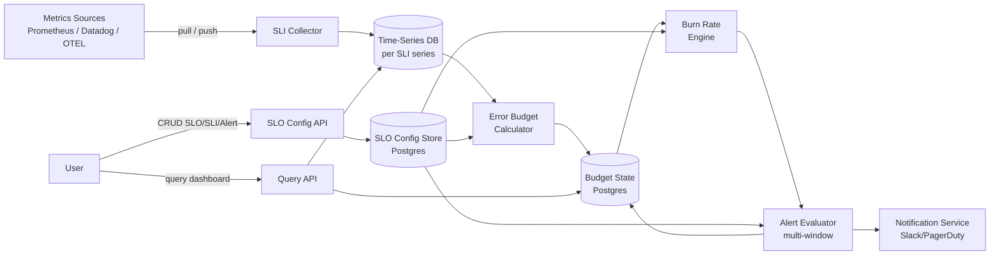
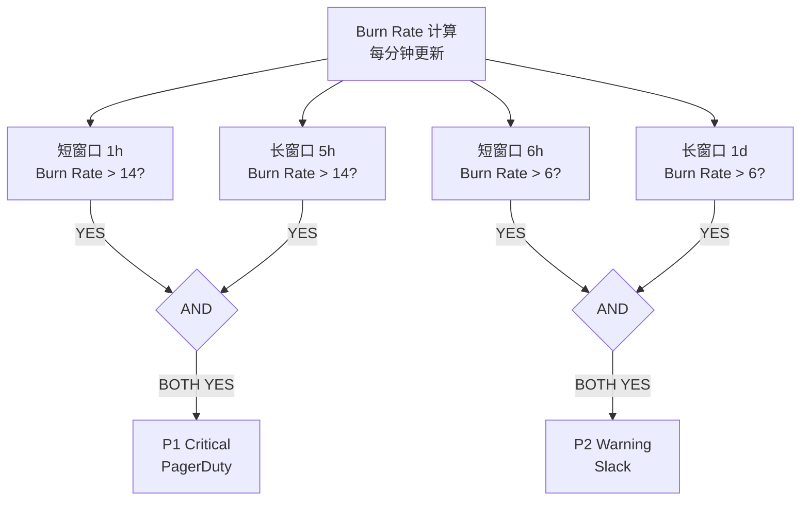

# System Design - SLO/SLI Management Platform

> Topics: Requirements → Core Entities → API → High Level Design (SLO Config + SLI Ingestion + Error Budget + Burn Rate Alert) → Deep Dives (Rolling window, Multi-window alerting, Composite SLO, Scale)

---

## Architecture Diagram



---

## 1. Requirements (~5 min)

SLO 平台是 SRE 工程的核心基础设施——它把"服务是否健康"从运维经验转化为可量化、可追踪的数字合约。设计这个系统的核心挑战是：**SLI 数据来自外部指标系统（Prometheus/Datadog），采集规模大；Error Budget 需要精确的时间窗口计算；Burn Rate Alert 需要在几分钟内触发，但不能产生大量误报**。

参考系统：Google SRE Error Budget、Nobl9、Datadog SLOs、Honeycomb SLOs。

### Functional Requirements

1. 用户可以定义 SLO（目标值 + 时间窗口）和关联的 SLI（数据来源 + 计算方式）
2. 系统持续计算每个 SLO 的 Error Budget（剩余量 + 消耗速率）
3. 用户可以定义 Burn Rate Alert（当消耗速率超过阈值时触发告警）
4. 用户可以在 Dashboard 查看 SLO 健康状态、Error Budget 趋势、历史告警

**Out of scope：** 底层指标采集（依赖已有 Prometheus/Datadog）、自动修复（只负责告警）、SLO 报告生成（另一功能）

### Non-Functional Requirements

| Metric | Target |
|--------|--------|
| SLI 数据延迟 | **< 1 分钟**（从指标产生到 Error Budget 更新）|
| Burn Rate Alert 延迟 | **< 5 分钟**（从超阈值到告警触发）|
| SLO 数量 | 支持**数千个 SLO**，每个 SLO 可能有多个 SLI |
| SLI 数据精度 | **分钟级**采集；支持 30 天滚动窗口计算 |
| 可用性 | **99.9%+**；Alert 路径高可靠 |
| 审计 | 所有 Error Budget 变更和告警历史可追溯 |

> **定性结论：** 这个系统是**计算密集型**而非存储密集型——核心难点在于如何高效地对时间窗口内的 SLI 数据做滚动聚合，以及如何设计 Burn Rate Alert 既足够敏感（快速发现问题）又不产生太多噪声（避免告警疲劳 Alert Fatigue）。Google 的多窗口 Multi-Window Burn Rate Alert 是业界最佳实践。

---

## 2. Core Entities (~2 min)

理解实体关系的关键：**SLO 是目标，SLI 是测量方式，Error Budget 是结果，Burn Rate 是当前消耗速率，Alert Rule 是触发条件**。一个 SLO 可以由多个 SLI 组合（Composite SLO）。

| Entity | Storage | 说明 |
|--------|---------|------|
| **SLO** | Postgres | 服务级别目标；含 service_id, target (0.999), window (30d), sli_ids |
| **SLI** | Postgres | 服务级别指标定义；含 type (availability/latency), data_source, query (PromQL/metric selector), good_threshold |
| **SLI DataPoint** | Time-Series DB | 原始 SLI 测量值；含 sli_id, timestamp, good_count, total_count |
| **ErrorBudget** | Postgres | 当前 Error Budget 状态；含 slo_id, window_start, total_budget, consumed, remaining_pct |
| **BurnRateSnapshot** | Postgres / Redis | 当前 Burn Rate；含 slo_id, window (1h/6h/3d), burn_rate, computed_at |
| **AlertRule** | Postgres | Burn Rate 告警规则；含 slo_id, short_window, long_window, burn_rate_threshold, severity |
| **AlertEvent** | Postgres (append-only) | 告警触发历史；含 rule_id, fired_at, resolved_at, burn_rate_at_fire |

---

## 3. 核心概念速查（面试前必须掌握）

面试时需要能流畅解释这四个概念及其关系。

**SLI（Service Level Indicator）**：对服务行为的量化测量。
- Availability SLI = `good_requests / total_requests`（成功请求占比）
- Latency SLI = `requests_under_threshold / total_requests`（满足延迟要求的请求占比）
- 数据来源：Prometheus counter、Datadog metric、OpenTelemetry span

**SLO（Service Level Objective）**：对 SLI 的目标承诺。
- "过去 30 天，Availability SLI ≥ 99.9%"
- "过去 30 天，P99 延迟 ≤ 200ms 的请求占比 ≥ 99.5%"

**Error Budget（误差预算）**：SLO 允许的失败空间。
```
Error Budget Total = (1 - SLO target) × window duration
例：SLO = 99.9%，30天窗口
Error Budget = 0.1% × 30天 = 43.2 分钟/月（允许宕机时间）
或：0.1% × 总请求数（允许失败的请求数）
```

**Burn Rate（消耗速率）**：Error Budget 的当前消耗速度，相对于"刚好在窗口结束时耗尽"的速度。
```
Burn Rate = 实际错误率 / (1 - SLO target)
例：SLO = 99.9%，当前错误率 = 1.4%
Burn Rate = 1.4% / 0.1% = 14
含义：以 14 倍速度消耗 Error Budget，30天的预算将在 ~2 天内耗尽
```

---

## 4. API / System Interface (~5 min)

| Endpoint | Method | Purpose |
|----------|--------|---------|
| `/slos` | POST | 创建 SLO（定义 target、window、关联 SLI）|
| `/slos/{id}` | GET/PATCH/DELETE | 查看/更新/删除 SLO |
| `/slis` | POST | 定义 SLI（数据来源、PromQL query、good 判断条件）|
| `/slos/{id}/budget` | GET | 查询当前 Error Budget 状态 |
| `/slos/{id}/burn-rate` | GET | 查询当前各窗口 Burn Rate |
| `/slos/{id}/alert-rules` | POST | 创建 Burn Rate Alert Rule |
| `/slos/{id}/history` | GET | 查询 Error Budget 历史趋势（时间序列）|
| `/slos/{id}/alerts` | GET | 查询告警历史 |

```
POST /slos
{
  "service": "checkout-api",
  "name": "Availability SLO",
  "target": 0.999,
  "window_days": 30,
  "sli_id": "sli_checkout_success_rate"
}

POST /slis
{
  "name": "Checkout Success Rate",
  "type": "availability",
  "data_source": "prometheus",
  "good_query": "sum(rate(http_requests_total{status!~'5.*'}[1m]))",
  "total_query": "sum(rate(http_requests_total[1m]))"
}

POST /slos/{id}/alert-rules
{
  "name": "Fast Burn Alert",
  "short_window": "1h",
  "long_window": "5h",
  "burn_rate_threshold": 14,
  "severity": "critical",
  "notifications": ["pagerduty:oncall"]
}
```

---

## 5. High Level Design (~10-15 min)

### SLO / SLI 配置

SLO Config API 把用户定义的 SLO 和 SLI 写入 Postgres（Config Store）。这是控制面 Control Plane，不在关键数据路径上，读写量小，普通 CRUD 即可。

**SLI 类型：**
- **Availability**：`good = 非5xx请求`，`total = 所有请求`
- **Latency**：`good = 延迟 < 阈值的请求`，`total = 所有请求`
- **Error Rate**：`good = 非错误事件`，`total = 所有事件`

### SLI 数据采集（Data Plane）

SLI Collector 从外部指标系统拉取数据，转化为统一的 `(timestamp, good_count, total_count)` 格式写入 TSDB。

```
每分钟（per SLI）：
1. 读取 SLI 配置（good_query + total_query）
2. 向 Prometheus/Datadog 发起查询
3. 计算 good_count 和 total_count
4. 写入 TSDB（sli_id, timestamp, good, total）
```

**Pull vs Push：**
- **Pull（推荐）**：Collector 主动查询 Prometheus，控制采集频率，避免数据源过载
- **Push**：数据源主动推送，实时性更好，但需要数据源做适配

**多数据源适配：** 用 Adapter 模式，每种数据源（Prometheus、Datadog、CloudWatch）有独立 Adapter，对外暴露统一接口 `query(metric, start, end) → [(timestamp, value)]`。

### Error Budget 计算

Error Budget Calculator 定时（每分钟）从 TSDB 读取 SLI 数据，计算滚动窗口内的 Error Budget 消耗。

```
对每个 SLO：
1. 从 TSDB 查询过去 30 天的 (good, total) 序列
2. 聚合：total_good = Σ good，total_requests = Σ total
3. 实际 SLI = total_good / total_requests
4. Budget consumed = (1 - 实际SLI) / (1 - SLO target) × 100%
5. Budget remaining = 100% - Budget consumed
6. 写入 ErrorBudget 表（upsert）
```

**滚动窗口 Rolling Window vs 日历窗口 Calendar Window：**
- 滚动窗口（推荐）：始终看"过去30天"，窗口随时间滑动，结果更平滑
- 日历窗口：每月1日重置，月末时预算很少，运维压力集中在月底

### Burn Rate 计算

Burn Rate Engine 计算当前错误率相对于 SLO 目标的倍数。Burn Rate > 1 表示正在消耗 Error Budget，Burn Rate = 14 表示 30 天的预算将在约 2 天内耗尽。

```
Burn Rate (window W) = 
  (1 - SLI over window W) / (1 - SLO target)

例：SLO = 99.9%，过去1小时错误率 = 1.4%
Burn Rate = (1 - 0.986) / (1 - 0.999) = 0.014 / 0.001 = 14
```

**多窗口并行计算：** 同时计算 1h、6h、3d 窗口的 Burn Rate，用于多窗口告警（见 Deep Dive）。

### Burn Rate Alert 评估

Alert Evaluator 定时检查各 SLO 的 Burn Rate 是否超过告警阈值，触发 Notification Service。

---

## 6. Deep Dives (~10 min)

### 6.1 滚动窗口 Error Budget 的精确计算

**问题：** 30 天滚动窗口需要查询 30 天的 SLI 数据，数据量大（30天 × 1440 分钟/天 = 43,200 个数据点 per SLI）。如果每分钟都全量重算，计算量是 SLO 数量 × 43,200。

**解法：增量计算 Incremental Computation**

维护一个滑动窗口的聚合状态：

```
每分钟更新时：
new_good = state.total_good + new_good_count - oldest_minute_good_count
new_total = state.total_requests + new_total_count - oldest_minute_total_count

只需要：最新一分钟的数据 + 滑出窗口的最旧一分钟的数据
不需要重扫 30 天所有数据
```

**存储优化：** 用 Circular Buffer（环形缓冲区）存储最近 43,200 分钟的 (good, total) 对，O(1) 查询最旧数据。可以存在 Redis（快速读写）或 TSDB（持久化）。

**精度权衡：** 分钟级聚合精度足够，不需要秒级。30 天窗口内几秒的误差对 Error Budget 计算无实际影响。

### 6.2 多窗口 Burn Rate Alert（Google SRE 最佳实践）

**问题：** 单窗口 Burn Rate Alert 有两个对立的问题：
- 短窗口（1小时）：敏感，但噪声多（短暂流量尖刺触发告警，实际问题已恢复）
- 长窗口（3天）：稳定，但发现问题太慢

**解法：双窗口（Two-Window）Burn Rate Alert**

Google SRE Book 的推荐方案：**同时检查短窗口和长窗口的 Burn Rate，两者都超阈值才触发告警**。

```
Alert 条件 = short_window_burn_rate > X AND long_window_burn_rate > X

短窗口：验证问题"现在仍在发生"
长窗口：验证问题"已经持续一段时间，不是偶发尖刺"
```

**Google 推荐的多级告警配置：**

| 告警级别 | 短窗口 | 长窗口 | Burn Rate 阈值 | 含义 | 行动 |
|---------|--------|--------|---------------|------|------|
| **P1 Critical** | 1h | 5h | 14× | 2 天耗尽 30 天预算 | 立即 PagerDuty |
| **P2 Warning** | 6h | 1d | 6× | 5 天耗尽预算 | Slack 通知，工作时间响应 |
| **P3 Info** | 3d | — | 3× | 10 天耗尽预算 | Ticket，排期修复 |

**为什么 Burn Rate = 14 触发 P1？**
```
30 天 / 14 = ~2.14 天
如果这个速度持续，2天内 Error Budget 耗尽
→ 需要立即响应（不能等到下班后）
```

**为什么需要长窗口验证？**
假设某服务短暂 5 分钟故障（Burn Rate = 100x），之后恢复正常：
- 1小时窗口：5分钟后仍显示高 Burn Rate（5/60 = 8.3% 时间在故障）→ 误报
- 5小时窗口：5/300 = 1.7% → Burn Rate 远低于阈值 → 正确不触发



### 6.3 Composite SLO（多 SLI 组合）

**问题：** 真实服务的 SLO 往往不只有一个维度。例如："Checkout API 的 Availability ≥ 99.9% 且 P99 延迟 ≤ 200ms"。需要两个 SLI 同时满足。

**解法：Composite SLO = 多 SLI 的 AND 或 Weighted Average**

```
AND 模式（最严格）：
  Composite SLI = min(SLI_availability, SLI_latency)
  只要有一个 SLI 不达标，Composite SLO 就不达标

加权平均 Weighted Average：
  Composite SLI = w1 × SLI_availability + w2 × SLI_latency
  允许一个维度略差，另一个维度补偿
```

**Error Budget 分配：**
Composite SLO 共享一个 Error Budget。任何一个 SLI 的失败都消耗同一个预算。运维团队需要决定哪个维度的失败权重更高。

### 6.4 SLI 数据采集规模化

**问题：** 数千个 SLO，每个 SLO 每分钟查询 Prometheus，可能造成 Prometheus 过载。

**解法：**

**Recording Rules（预聚合）：**
在 Prometheus 侧配置 Recording Rules，把高成本查询（如 `sum(rate(http_requests_total[5m]))` 对所有 label 组合）预聚合为低成本的查询目标。SLI Collector 只查询预聚合结果，查询成本极低。

**批量查询 Batching：**
不是每个 SLI 发起独立 HTTP 请求，而是把同一数据源的多个 SLI 查询合并为一个 batch 请求（Prometheus Range Query API 支持多 query）。

**本地缓存：**
SLI Collector 缓存最近5分钟的查询结果（TTL = 采集间隔），避免对同一指标的重复查询（多个 SLO 可能共用同一底层 SLI）。

---

## Architecture Summary

```
[SLO 配置流程]
用户 → SLO Config API → Postgres（SLO + SLI + AlertRule）

[SLI 数据采集流程]
每分钟（per SLI）：
SLI Collector → Prometheus/Datadog（PromQL query）
→ (timestamp, good_count, total_count) → TSDB

[Error Budget 计算流程]
每分钟（per SLO）：
Budget Calculator 读 TSDB → 增量滑动窗口计算
→ 更新 ErrorBudget（upsert）+ BurnRateSnapshot

[Burn Rate Alert 流程]
每分钟：
Alert Evaluator → 读 BurnRateSnapshot
→ 双窗口条件判断（short_window AND long_window）
→ 触发 → Notification Service → PagerDuty / Slack
→ 写 AlertEvent（append-only）

[关键技术选型]
- SLO/SLI 配置:    Postgres（低频 CRUD）
- SLI 原始数据:     Time-Series DB（分钟级数据点）
- Budget 状态:      Postgres（当前状态）+ Redis（热点缓存）
- Burn Rate 快照:   Redis（高频读写，TTL 控制）
- Alert 历史:       Postgres append-only
- 数据采集:         Pull 模式 + Recording Rules + Batch 查询

[关键数学]
Error Budget = (1 - SLO target) × window
Burn Rate    = actual_error_rate / (1 - SLO target)
Time to exhaustion = window / burn_rate

[Google 推荐告警阈值]
P1: Burn Rate > 14 (short 1h + long 5h) → 2 天耗尽
P2: Burn Rate > 6  (short 6h + long 1d) → 5 天耗尽
P3: Burn Rate > 3  (slow burn, 3d)      → 10 天耗尽
```

---

## Glossary

| 术语 | 一句话解释 |
|------|-----------|
| **SLI (Service Level Indicator)** | 对服务行为的量化测量；通常是 good_events / total_events |
| **SLO (Service Level Objective)** | 对 SLI 的目标承诺；如"30天内 Availability ≥ 99.9%" |
| **Error Budget** | SLO 允许的失败空间；= (1 - SLO target) × window |
| **Burn Rate** | Error Budget 当前消耗速率；= 实际错误率 / (1 - SLO target)；1 = 刚好按时耗尽 |
| **Rolling Window** | 时间窗口随当前时间滑动（始终看"过去30天"）；比日历窗口更平滑 |
| **Multi-Window Alert** | 同时检查短窗口和长窗口 Burn Rate；短窗口检测现在是否在发生，长窗口过滤短暂尖刺 |
| **Recording Rules** | Prometheus 预聚合规则；把高成本查询提前计算好，SLI Collector 直接查结果 |
| **Composite SLO** | 多个 SLI 组合的 SLO；AND 模式（最严格）或加权平均 |
| **Alert Fatigue** | 告警过多导致运维人员忽视告警；Multi-window 设计减少误报是解法之一 |
| **Incremental Computation** | 滑动窗口聚合时只计算新增和滑出的数据点，避免全量重扫 |
| **Time to Exhaustion** | Error Budget 按当前 Burn Rate 多久耗尽；= window / burn_rate |

---

## Interview Tips

1. **先讲清楚四个概念的数学关系。** "SLI 是测量值，SLO 是目标，Error Budget = (1-target)×window，Burn Rate = 实际错误率 / (1-target)。Burn Rate 14 意味着 30 天预算将在 2 天内耗尽。" 数学讲清楚了，设计就自然了。

2. **Rolling Window vs Calendar Window 是好问题。** 主动提出："我们用滚动窗口而非日历窗口——每月1日不应该是 Error Budget 重置的魔法时刻，运维压力不应该集中在月末。"

3. **Multi-window Alert 是区分 Senior 和 Mid-level 的关键。** 只说"Burn Rate 超过阈值就告警"是 Mid-level 答案。说出"短窗口检测当前是否在发生，长窗口过滤短暂尖刺，两者都超才触发"才是 Senior 答案。引用 Google SRE Book 的具体数字（14x/1h+5h）更加分。

4. **增量计算是规模化的关键。** "不能每分钟全量重扫 30 天的 TSDB 数据。用 Circular Buffer 维护滑动窗口状态，每次只处理新进和滑出的数据点，O(1) 更新。"

5. **Composite SLO 展示产品思维。** "真实服务的 SLO 有多个维度——可用性 AND 延迟。Composite SLO 让运维团队用一个数字衡量服务整体健康，而不是同时盯着十几个独立指标。"

6. **Alert Fatigue 是 SRE 现实问题。** "告警设计的目标不是捕获所有问题，而是只在需要人工介入时告警。Burn Rate < 1 说明 Error Budget 还在增长（服务正在恢复），不应该触发告警。"
