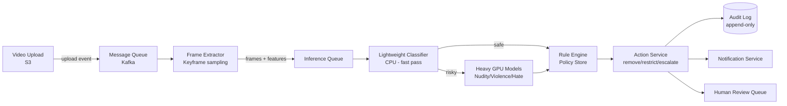

# System Design - Video Moderation System

> Topics: Requirements → Core Entities → API → High Level Design (Upload → Pipeline → Action → Audit) → Deep Dives (Near real-time SLA, Rule Engine, Event-driven pipeline, Global scale)

---

## Architecture Diagram



---

## 1. Requirements (~5 min)

视频审核系统设计的核心矛盾：**速度与准确性之间的权衡**。每天数百万视频上传，要求近实时（秒级）处理，但 ML 模型推理耗时；与此同时，误判（漏判违规 False Negative 或错误删除 False Positive）代价极高，两者都会带来严重的法律和业务风险。

这道题考察的是：多阶段流水线设计、ML 推理的规模化、策略/规则的版本化管理、幂等性保证、以及全球化合规。这些正是 AI Infra Manager 的核心域。

### Functional Requirements

1. 视频上传后近实时评估策略合规性（全球一致的结果）
2. 安全运营团队 Safety Operators 可以在不重新部署服务的情况下创建、测试、发布规则策略
3. 检测到违规时，自动执行相应操作（删除、年龄门控 Age-gate、地理封锁 Geo-block、升级人工审核）并通知相关方
4. 授权审核人员和合规团队可查看每个决策的完整审计轨迹（含模型版本、分数、规则、操作）

**Out of scope：** 直播流实时审核（Livestream）、用户举报机制（另一系统）、内容推荐降权（另一系统）

### Non-Functional Requirements

| Metric | Target |
|--------|--------|
| 处理延迟 | **P95 < 5秒**（上传到首次决策）|
| 日上传量 | **数百万视频/天**（~50 videos/sec 平均，峰值更高）|
| 可用性 | **99.9%+**；审核失败时安全降级（暂扣而非直接放行）|
| 审计保留 | **数年**（满足法律合规要求）|
| 幂等性 | 网络重试不得导致重复删除或重复通知 |
| 数据驻留 | 满足各地区数据本地化法规（EU GDPR、中国数据安全法）|

> **定性结论：** 审核失败应 Fail Safe（暂扣等待人工）而非 Fail Open（直接放行）。ML 是辅助工具，不是最终裁判——规则引擎叠加在 ML 分数上才是最终决策。所有决策必须可解释、可追溯，不能是黑盒。

---

## 2. Core Entities (~2 min)

审核系统的实体设计关键在于：**把"决策"和"操作"分离**。`ModerationDecision` 是事实，`ActionRecord` 是执行结果。分离后，同一决策可以对应多个操作（如同时删除 + 通知），也可以在上诉时撤销操作而不修改决策记录。

| Entity | Storage | 说明 |
|--------|---------|------|
| **Video** | Postgres + S3 | 视频元数据 + 文件；含 creator_id, region, upload_time |
| **ModerationJob** | Postgres | 一次审核任务；含 video_id, status, pipeline_version |
| **MLScore** | Postgres / ClickHouse | 每个模型对视频的评分；含 model_id, model_version, score, category |
| **PolicyRule** | Postgres | 版本化策略规则；含 rule_id, version, status (draft/shadow/canary/global), DSL |
| **ModerationDecision** | Postgres | 最终决策记录；含 job_id, action, rule_fired, scores_snapshot, decided_at |
| **AuditEvent** | Append-only log (ClickHouse / S3) | 不可变审计事件；含所有中间状态、模型哈希、规则版本、操作者 |
| **HumanReviewTask** | Postgres / Queue | 升级到人工审核的任务；含优先级、SLA deadline |

---

## 3. API / System Interface (~5 min)

审核系统有两类接口：**内部触发接口**（由上传事件驱动，非用户直接调用）和**运营管理接口**（供 Safety Operators 使用）。

| Endpoint | 调用方 | Purpose | Key Design |
|----------|--------|---------|------------|
| `POST /moderation/jobs` | Upload Service（内部）| 触发审核 Job | 幂等：video_id 作为幂等键，重复提交返回已有 Job |
| `GET /moderation/jobs/{jobId}` | 内部服务 | 查询 Job 状态 | 供 Upload Service 轮询或 Webhook 回调 |
| `GET /moderation/videos/{videoId}/audit` | 合规团队 | 查看完整审计轨迹 | 返回所有 AuditEvent，含模型版本、规则、分数、操作 |
| `POST /policies/rules` | Safety Operators | 创建/更新策略规则 | 版本化；默认创建为 draft 状态 |
| `PATCH /policies/rules/{ruleId}/status` | Safety Operators | 推进规则状态（draft→shadow→canary→global）| 支持 Shadow Mode 和 Canary 灰度 |
| `POST /policies/rules/{ruleId}/simulate` | Safety Operators | 对历史流量模拟规则效果 | 不产生实际操作，仅返回"如果规则生效会怎样" |
| `POST /moderation/decisions/{decisionId}/appeal` | 用户/法务 | 上诉申请 | 触发人工复审；通过后撤销操作（Saga 补偿）|

---

## 4. High Level Design (~10-15 min)

### 上传触发审核

视频审核不是同步调用，而是**事件驱动的异步流水线**。上传完成后立即触发，用户无需等待审核结果（视频处于"审核中"状态，可能对部分用户可见，也可能暂扣）。

```
用户上传视频
→ Upload Service 写 metadata → Postgres（status=pending_moderation）
→ 视频文件 → S3
→ S3 上传事件 → Kafka（video.uploaded topic）
→ Moderation Orchestrator 消费事件 → 创建 ModerationJob → 启动流水线
```

**关键决策：上传后视频立即可见还是审核通过后可见？**
- **Optimistic（上传即可见）**：用户体验好，但违规内容在审核完成前短暂可见。适合低风险平台。
- **Pessimistic（审核通过才可见）**：内容安全性更高，但上传体验差（等待5秒以上）。适合高风险内容类型或新账号。
- **实际系统（如 TikTok）**：高信任创作者 Optimistic；新账号或高风险地区 Pessimistic。

### 多阶段审核流水线

流水线的核心设计是**级联推断 Cascaded Inference**：不是对每个视频都运行所有重型 GPU 模型，而是先用轻量分类器做快速过滤，只把高风险内容送到重型模型。大幅降低计算成本。

```
ModerationJob 创建
    → Stage 1: Frame Extractor（关键帧提取 Keyframe Sampling，每秒N帧）
    → Stage 2: Lightweight Classifier（CPU，快速，覆盖所有视频）
        → 低风险（score < 0.3）→ 直接进 Rule Engine（PASS）
        → 中风险（0.3-0.7）→ 进 Heavy GPU Models
        → 高风险（> 0.7）→ 并行进 Heavy GPU Models + 立即暂扣
    → Stage 3: Heavy GPU Models（多类别并行：裸露/暴力/仇恨/版权）
    → Stage 4: Rule Engine（聚合所有 ML Scores + 元数据 → 最终决策）
    → Stage 5: Action Service（执行操作 + 写 AuditLog + 发通知）
```

| Stage | 延迟预算 | 扩展方式 |
|-------|---------|---------|
| Frame Extractor | < 500ms | CPU，水平扩展 |
| Lightweight Classifier | < 500ms | CPU，高并行 |
| Heavy GPU Models | < 2s（并行） | GPU Pool，按负载扩缩 |
| Rule Engine | < 200ms | CPU，无状态 |
| Action Service | < 300ms | 幂等，水平扩展 |
| **总计 P95** | **< 5s** | |

### 决策执行与操作

Action Service 负责把决策翻译成实际操作。**所有操作必须幂等**——网络重试不能导致重复删除或重复通知。

| 操作 | 实现 | 幂等保证 |
|------|------|---------|
| **Remove（删除）** | 更新 DB status=removed，CDN 缓存失效 | decision_id 作幂等键，重复调用返回已删除状态 |
| **Age-gate（年龄门控）** | 更新 visibility_policy=age_restricted | 状态机，重复设置无副作用 |
| **Geo-block（地理封锁）** | 写入 geo_restriction 表，CDN 按地区封锁 | 幂等写入 |
| **Escalate（升级人工）** | 创建 HumanReviewTask，写入 Queue | task_id = decision_id，重复创建忽略 |
| **Notify（通知）** | 触发 Notification Service | 去重：per decision_id 只发一次 |

---

## 5. Deep Dives (~10 min)

### 5.1 如何满足近实时 SLA（P95 < 5s）

**延迟预算 Latency Budget 分配** 是面试中展示系统思维的关键动作。把总 SLA 分解到每个 Stage，才能知道哪里需要优化、哪里有余量。

**级联推断 Cascaded Inference 的经济学：**
- 全部视频跑重型 GPU 模型：成本高，延迟高
- 轻量分类器先过滤：70-80% 的视频（明显安全内容）不需要 GPU，成本大幅降低
- 高风险内容（< 5%）立即并行送所有重型模型，不等轻量分类器结果

**背压控制 Backpressure：**
各 Stage 之间用 Kafka 解耦，每个 Stage 独立扩缩容。当 GPU Queue 积压时：
- 优先处理高风险内容（创作者历史违规记录、新账号、热门视频）
- 对低优先级内容延长审核窗口（5s → 30s），暂时维持暂扣状态
- 防止雪崩：Queue 满时拒绝新任务并告警，而不是无限积压

**优先级队列 Priority Queue：**

| 优先级 | 内容特征 | 处理目标 |
|--------|---------|---------|
| P0 | 创作者历史违规、新注册账号、举报视频 | P95 < 2s |
| P1 | 普通上传 | P95 < 5s |
| P2 | 低活跃创作者、冷内容 | P95 < 30s |

**降级策略 Graceful Degradation：**
- GPU 集群故障时：自动降级到仅轻量分类器 + 人工审核队列
- 不能因为重型模型不可用就直接放行内容（Fail Open）
- 暂扣 + 人工复审是安全的降级路径

### 5.2 规则引擎（Safety Operators 无需重部署即可更新规则）

**问题：** 内容安全策略变化极快（新型违规内容、法规更新、突发事件），不能每次修改规则都要工程师重新部署服务。

**解法：外部化、版本化的规则引擎 Externalized Rule Engine**

规则用 DSL（Domain-Specific Language）表达，存储在 Policy Store（Postgres）中，Rule Engine 服务运行时动态加载：

```
// 示例规则 DSL
IF nudity_score > 0.85
   AND creator_tier != "verified"
   AND region IN ["US", "EU"]
THEN action = REMOVE, priority = HIGH
```

**规则生命周期 Lifecycle：**

```
Draft → Shadow → Canary → Global
```

| 状态 | 行为 | 目的 |
|------|------|------|
| **Draft** | 不执行，仅存储 | 规则编写阶段 |
| **Shadow** | 执行但不产生实际操作，仅记录"如果生效会怎样" | 验证规则效果，不影响生产 |
| **Canary** | 对 1-5% 流量生效，产生真实操作 | 灰度验证，监控误判率 |
| **Global** | 对所有流量生效 | 全量发布 |

**评估确定性 Determinism：**
Rule Engine 的输入必须被冻结快照：
- 快照当时的 ML Scores（含模型版本）
- 快照视频元数据（发布时间、创作者信息）
- 记录使用的规则版本号

这样6个月后审计时，可以完全重放决策过程，回答"为什么这个视频被删除"。

**Shadow Mode 测试：**
新规则发布前，在 Shadow 模式下对历史流量跑模拟，输出：
- 如果规则生效，会删除哪些视频？（False Positive 风险）
- 如果规则生效，会放行哪些违规视频？（False Negative 风险）

运营团队看到报告后再决定是否推进到 Canary。

### 5.3 事件驱动流水线（幂等性 + 完整审计）

**问题：** 流式系统天然是 At-least-once Delivery（至少一次投递）。网络重试可能导致同一视频被审核两次，同一删除操作被执行两次。

**幂等性 Idempotency 设计：**

```
每个 ModerationJob 有唯一的 job_id
每个 Decision 有唯一的 decision_id
Action Service 以 decision_id 为幂等键：
  → 同一 decision_id 的 Remove 操作，第二次调用检测到已执行，直接返回成功
  → 不产生副作用（不会重复通知用户）
```

**Saga 模式（Saga Pattern）处理分布式操作：**

一次审核决策可能涉及多个操作（删除 DB 记录 + 失效 CDN 缓存 + 发通知 + 创建人工任务）。这些操作分布在不同服务，任一步骤失败都需要补偿：

```
Saga Steps:
1. 更新 Video status=removed（DB）
2. 失效 CDN 缓存
3. 发用户通知
4. 写 AuditEvent

任一步骤失败 → 执行补偿 Compensation：
  - CDN 失效失败 → 重试（CDN 操作幂等）
  - 通知失败 → 写入重试队列
  - 所有操作完成 → Saga 标记为 completed
```

**上诉处理 Appeal：**
用户上诉后，Saga 执行补偿事务：恢复 Video status → 重新激活 CDN → 通知用户。原始 AuditEvent 不修改（不可变），只追加新的 appeal_decision 事件。

**审计日志 Audit Log 设计：**

| 要求 | 实现 |
|------|------|
| **不可变 Immutable** | Append-only；禁止 UPDATE/DELETE |
| **完整上下文** | 每个事件包含：model_hash、rule_version、scores、operator、request_id、timestamp |
| **高写入吞吐** | 按 date + region 分区；ClickHouse 或 S3 + Parquet |
| **可查询** | 按 video_id、operator、action_type 索引 |
| **法律保留** | 保留数年；Write-once 存储（S3 Object Lock）|

### 5.4 全球化（数据驻留 + 多 Region）

**核心原则：热路径 Hot Path 本地化，冷路径 Cold Path 异步复制。**

法规要求（如 EU GDPR、中国数据安全法）禁止某些数据出境。同时，跨 Region 的网络延迟会让 5s SLA 无法实现。

**区域化部署 Regional Deployment：**

```
每个 Region（US / EU / APAC）独立部署：
  - 视频存储（S3 Regional Bucket）
  - Frame Extractor + ML Inference（Regional GPU Pool）
  - Rule Engine（同步全局 Policy，但本地评估）
  - AuditLog（本地存储，满足数据驻留）

仅异步复制：
  - 轻量决策摘要（不含原始媒体）→ 全局数据仓库（用于全球报告）
  - Policy 版本（Global Registry → 各 Region 同步）
```

**模型和规则版本管理：**
- Global Model Registry：统一管理模型版本，按 Region 推送
- Policy 版本按 Region 独立 Canary：先在低风险 Region 验证，再全球推送
- 评估时固定 model_version + rule_version：保证同一视频在任何 Region 处理结果一致（Deterministic）

**Region 故障处理：**
- 某 Region GPU 集群故障 → 降级到轻量分类器 + 扩大人工审核队列
- Kafka 跨 Region Topic Mirroring：灾备场景下可切换到备用 Region 处理
- 分区期间（网络分裂）：允许 Policy 暂时不同步，但记录 divergence，恢复后对齐

---

## Architecture Summary

```
[上传触发流水线]
用户上传 → S3 → Kafka(video.uploaded)
→ Moderation Orchestrator → 创建 ModerationJob
→ Stage 1: Frame Extractor（关键帧采样）
→ Stage 2: Lightweight Classifier（CPU 快速过滤）
    低风险 → Rule Engine
    中/高风险 → Heavy GPU Models（并行多类别）
→ Stage 3: Rule Engine（聚合 ML Scores + 元数据 → 决策）
→ Stage 4: Action Service（幂等执行：删除/限制/升级/通知）
→ AuditLog（Append-only，永久保留）

[规则管理]
Safety Operators → Policy Store（Postgres）
→ Draft → Shadow（仿真） → Canary（灰度）→ Global
→ Rule Engine 运行时动态加载，无需重部署

[上诉流程]
用户上诉 → Human Review Queue → 审核员决定
→ Saga 补偿：恢复视频 + 失效 CDN 删除缓存 + 通知
→ AuditLog 追加 appeal_decision 事件（原记录不修改）

[关键技术选型]
- 写入缓冲:   Kafka（各 Stage 解耦，独立扩缩容，背压控制）
- ML 推理:    级联推断（Lightweight CPU → Heavy GPU）+ 优先级队列
- 规则引擎:   外部化 DSL + 版本化 + Shadow/Canary 渐进发布
- 幂等性:     decision_id 幂等键 + Transactional Outbox
- 一致性:     Saga 模式（分布式多步操作 + 补偿事务）
- 审计:       Append-only ClickHouse/S3，Write-once，含模型哈希+规则版本
- 全球化:     热路径区域化，冷路径异步复制，数据驻留本地

[NUMBERS]
数百万视频/天 → ~50 videos/sec 平均，峰值更高
P95 SLA < 5s → 分解到各 Stage 的延迟预算
70-80% 视频轻量分类器即可处理 → 节省 GPU 成本
审计日志保留数年 → Append-only + S3 Object Lock
```

---

## Glossary

| 术语 | 一句话解释 |
|------|-----------|
| **Cascaded Inference（级联推断）** | 先用轻量 CPU 分类器过滤，只把高风险内容送重型 GPU 模型；降低成本，缩短平均延迟 |
| **Latency Budget（延迟预算）** | 将总 SLA 分解到每个 Stage 的最大允许延迟；驱动各 Stage 的优化目标 |
| **Backpressure（背压）** | 下游处理能力不足时，向上游发出限速信号；Kafka Queue 积压是背压的自然体现 |
| **Idempotency（幂等性）** | 同一操作执行多次与执行一次效果相同；网络重试安全 |
| **Saga Pattern** | 分布式多步操作的事务模式；每步成功后继续，失败时执行补偿（Compensation）回滚 |
| **Transactional Outbox** | 将消息发布和 DB 写入放在同一事务中；保证消息不丢失、不重复 |
| **Shadow Mode（影子模式）** | 新规则执行但不产生真实操作，仅记录"如果生效会怎样"；安全验证新规则 |
| **Canary Rollout（金丝雀发布）** | 新规则先对 1-5% 流量生效，观察误判率后再全量推送 |
| **DSL（Domain-Specific Language）** | 专为特定场景设计的语言；Safety Operators 用 DSL 表达策略规则，无需写代码 |
| **Fail Safe** | 失败时选择安全一侧（暂扣内容）而非风险一侧（直接放行）|
| **Data Residency（数据驻留）** | 法规要求数据存储在特定地理区域内，不得出境 |
| **Deterministic Evaluation（确定性评估）** | 固定输入（model_version + rule_version + scores）保证同一视频任何时候重放决策结果相同 |
| **Append-only Audit Log** | 只能追加不能修改的日志；保证审计轨迹不被篡改 |
| **False Positive** | 误判：正常内容被错误删除；对创作者有直接伤害 |
| **False Negative** | 漏判：违规内容未被检测；对平台和用户有安全风险 |

---

## Interview Tips

1. **先说 Fail Safe 原则。** "审核失败应暂扣而非直接放行。轻量分类器不确定时，进重型模型；重型模型也不确定时，进人工审核队列。" 这展示了对内容安全的理解，不是纯技术题。

2. **延迟预算是加分动作。** 主动说"我们把 P95 5s 分解到各 Stage：帧提取 500ms、轻量分类 500ms、GPU 推理 2s、规则评估 200ms、操作执行 300ms"——展示了真实的系统设计思维。

3. **级联推断体现 ML Infra 视角。** "不是所有视频都需要 GPU 模型。70-80% 的上传是明显安全内容，轻量 CPU 分类器即可处理，GPU 只留给真正高风险内容。" 这是 AI Infra Manager 的核心语言。

4. **规则引擎 Shadow Mode 是差异化点。** 大多数候选人只说"规则引擎"，能说出 Draft→Shadow→Canary→Global 生命周期和 Shadow Mode 仿真原理的候选人展示了真实的运营经验。

5. **幂等性不能跳过。** "所有操作都以 decision_id 为幂等键。Kafka At-least-once 投递意味着同一审核任务可能被处理两次，不处理幂等会导致用户被重复通知或重复删除。" 这是流式系统的基础素养。

6. **元监控和降级是 Staff 级别话题。** "GPU 集群故障时，降级到轻量分类器 + 扩大人工审核队列，而不是直接放行内容。SLA 变宽，但安全不降级。" 展示了对 Reliability 的深度理解。
