# System Design Quick Reference — 25 Cases

> Source: Growing - 个人成长管理系统.pdf
> 25 cases. One section per system.

| #   | Case                                        |
| --- | ------------------------------------------- |
| 1   | [[#1. Design Bit.ly]]                       |
| 2   | [[#2. Design YouTube]]                      |
| 3   | [[#3. Design a Job Scheduler]]              |
| 4   | [[#4. Design Yelp]]                         |
| 5   | [[#5. Design Ticketmaster]]                 |
| 6   | [[#6. Design LeetCode]]                     |
| 7   | [[#7. Design Strava]]                       |
| 8   | [[#8. Design Tinder]]                       |
| 9   | [[#9. Design a Local Delivery Service]]     |
| 10  | [[#10. Design Web Crawler]]                 |
| 11  | [[#11. Design Uber]]                        |
| 12  | [[#12. Design FB Live Comments]]            |
| 13  | [[#13. Design Ad Click Aggregator]]         |
| 14  | [[#14. Design YouTube Top K]]               |
| 15  | [[#15. Design a News Aggregator]]           |
| 16  | [[#16. Design a Price Tracking Service]]    |
| 17  | [[#17. Design Online Auction]]              |
| 18  | [[#18. Design WhatsApp]]                    |
| 19  | [[#19. Design Instagram]]                   |
| 20  | [[#20. Design FB Post Search]]              |
| 21  | [[#21. Design Robinhood]]                   |
| 22  | [[#22. Design Google Docs]]                 |
| 23  | [[#23. Design Dropbox]]                     |
| 24  | [[#24. Design a Distributed Cache]]         |
| 25  | [[#25. Design a Payment System]]            |
| 26  | [[#26. Design TikTok / Douyin]]             |
| 27  | [[#27. Design ChatGPT]]                     |
| 28  | [[#28. Design Metrics Monitoring Platform]] |
| 29  | [[#29. Design Video Moderation System]]     |

---

## 1. Design Bit.ly

**Requirements**
- Generate shortened URL
- Access original URL by using shortened URL

**NFR**
- Uniqueness (no 2 long URLs to one shortened)
- Availability
- Latency
- Scalability

**Entities:** Original URL, Shortened URL, User

**Components**
- 302 redirect — more control, browser cannot cache, enables click statistics
- Unique Counter + Base62 Encoding
- Cache (key-value: short → original)
- CDN
- Postgres — DB replication, DB backup, scale primary server
- Unique Counter — batch read

**API**
```
POST /urls
{
  original_url
  custom_alias
  expiration_date
}

GET /{shortURL}
→ 302 temporary redirect to original URL
```

**Data Models**
```
Urls
  id
  original_url
  short_url
  custom_alias
  expiration_date
  creator
```

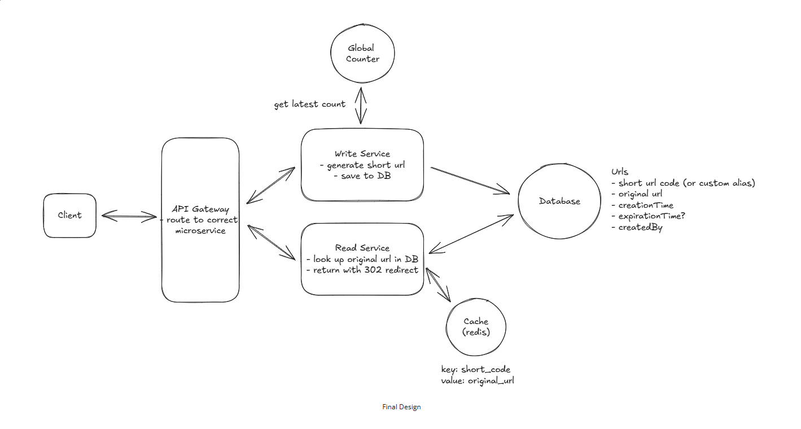

---

## 2. Design YouTube

**Requirements**
- Upload
- Watch

**NFR**
- Availability
- Latency
- Large files / resumable
- Scalability

**Entities:** User, Video, Video Metadata, Chunk

**Components**
- Block Storage: S3 with presigned URL
- VideoMetadata DB
- Message Queue: Transcode / audit process (DAG)
- CDN
- Adaptive bitrate streaming
- Chunk-based upload
- Redis cache: Video metadata
- Upload Monitor

**API**
```
POST /upload
GET /videos/{videoId}
```

**Data Models**
```
VideoMetadata
  id
  title
  description
  user
  S3 URLs
  chunks
```

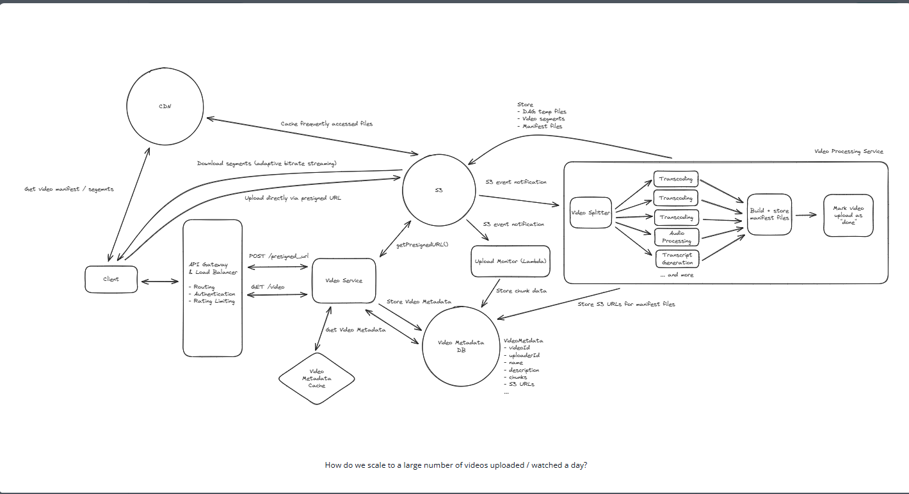

---

## 3. Design a Job Scheduler

**Requirements**
- Schedule jobs to execute (once or recurring)
- Monitor the status

**NFR**
- Availability
- Latency
- Scalability
- At least once delivery

**Entities:** User, Jobs, Tasks, Schedule

**Components**
- Message Queue
- Task executor / coordinator / worker
- Scheduler / query service
- Idempotent processing
- SQS: Visibility timeout mechanism

**API**
```
POST /jobs
{
  task
  schedule
  parameters
}

GET /jobs?userId&status
```

**Data Models**
```
Job
  id
  task
  schedule
  parameter
  userId

Execution
  id
  jobId
  userId
  status
  started
  attempt
```


---

## 4. Design Yelp

**Requirements**
- Search businesses
- View business details
- Write / read reviews

**NFR**
- Availability
- Latency
- Scalability

**Entities:** User, Business, Review

**Components**
- Elasticsearch: Full-text + geospatial search with CDC
- Redis Cache
- Rating aggregation: Optimistic locking (review_num as version)
- DB constraint: One user one review per business
- Pre-defined locations: geo_shape in Elasticsearch

**API**
```
GET /business?query&location&category&page
GET /business/{businessId}
GET /business/{businessId}/reviews
POST /business/{businessId}/reviews
{
  rating
  text
}
```

**Data Models**
```
Business
  id
  lat/long
  name
  address
  description
  category
  review_num
  avgRating
  locations

Review
  id
  businessId
  userId
  rating
  comments
  created

Location
  id
  name
  type
  points
```


---

## 5. Design Ticketmaster

**Requirements**
- Search events
- View event details
- Book tickets

**NFR**
- Availability for search
- Strong consistency for booking
- Latency
- Scalability

**Entities:** Event, Venue, Performer, Ticket, Booking

**Components**
- Elasticsearch: Full-text search
- Redis: Distributed lock (TTL) + Cache
- Message Queue: Virtual waiting list
- WebSockets: Real-time queue updates
- CDN + Load Balancer

**API**
```
GET /events/{eventId}
GET /events?query&start_date&end_date&pageSize
POST /bookings/{eventId}
{
  ticketIds
  paymentDetails
}
```

**Data Models**
```
Event
  venue
  description
  performer
  date
  tickets

Ticket
  eventId
  seat
  price
  status
  userId

Venue
  id
  location
  seatMap

Performer
  id
  name
  description

Booking
  id
  userId
  tickets
```


---

## 6. Design LeetCode

**Requirements**
- Search / view / code problems
- Submit solutions
- Competition leaderboard

**NFR**
- Availability
- Isolation (sandboxed execution)
- Latency
- Scalability

**Entities:** User, Problem, Submission, Leaderboard

**Components**
- Container / Executor: Sandboxed code execution
- Redis: Leaderboard (sorted set)
- Message Queue: Async submission processing
- Executor coordinator
- Test case serialization: Multi-language support

**API**
```
GET /problems?page
GET /problems/{problemId}?language
POST /problems/{problemId}/submit
{
  code
  language
}
GET /leaderboard/{competitionId}?page
```

**Data Models**
```
Problem
  id
  title
  description
  code stubs
  test cases

Submission
  id
  submitter
  submitTime
  language
  code
  test result
  errors
```

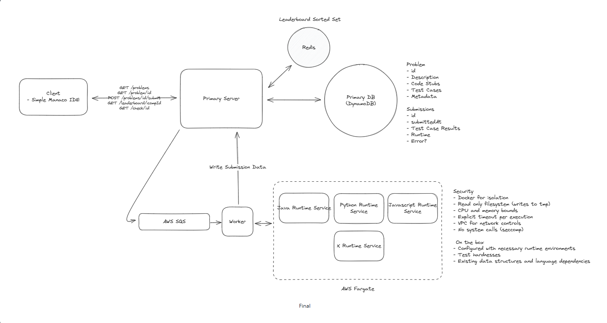

---

## 7. Design Strava

**Requirements**
- Create / pause / resume route (run / ride)
- Record and view activity data
- View friends' activities

**NFR**
- Availability
- Latency (real-time accuracy)
- Reliability (offline support)
- Scalability

**Entities:** User, Activity, Route, Friends

**Components**
- Local storage: In-memory + file-based
- Local DB: Offline support
- Activity cache
- Time-based sharding
- Data tiering: Hot (cache) → Warm → Cold (S3)
- Long polling: Real-time updates
- Redis leaderboard: Sorted set

**API**
```
POST /activities { type }
PATCH /activities/{activityId} { state }
POST /activities/{activityId}/routes { location }
GET /activities?mode&starttime&page
GET /activities/{activityId}
```

**Data Models**
```
Activity
  id
  type
  userId
  createdAt
  routes
  status
  statusEvent
  distance

Route
  activityId
  lat/long
  timestamp

Friend
  user1
  user2
  createdAt
```

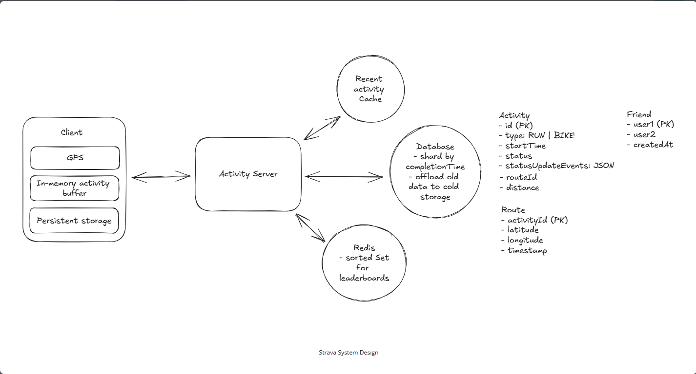

---

## 8. Design Tinder

**Requirements**
- Create profile with preferences
- Search potential matches by distance
- Swipe yes / no
- Match notification

**NFR**
- Strong consistency on match
- Availability for search
- Latency
- Scalability
- Avoid showing previously swiped users

**Entities:** Profile, Swipe, Match

**Components**
- Elasticsearch: Geospatial search with CDC
- Push notifications: APNS / FCM
- Redis + LUA script: Atomic swipe + match check
- Cassandra: Swipe history with PK (from_user, to_user) for single-partition transactions
- Cache / Bloom filter: Avoid showing previous swipes
- Pre-computation: Candidate caching

**API**
```
POST /profile
{
  age_min, age_max
  distance
  interestedIn
}
GET /feed?lat&long
POST /swipe/{userId} { decision }
```

**Data Models**
```
Profile
  id
  userId
  name
  description
  agePrefer
  genderPrefer
  maxDistance

Match
  userpair
  user1
  user2
  like
  createdAt
```


---

## 9. Design a Local Delivery Service

**Requirements**
- Query items by location / delivery time
- Place order

**NFR**
- Availability for search
- Strong consistency for ordering
- Latency
- Scalability

**Entities:** Item, Inventory, Distribution Center, Order / OrderItem

**Components**
- Elasticsearch: Product search with CDC
- Availability Service: Check inventory + delivery time
- Nearby Service: Distance calculation
- PostgreSQL transaction: ACID guarantees
- Two-phase filtering: Distance → Travel time
- Regional partitioning + caching

**API**
```
GET /availability?location&keyword&page
POST /order
{
  lat, long
  items
}
```

**Data Models**
```
DistributionCenter
  name
  lat/long

Inventory
  id
  itemId
  quantity
  DCId

Item
  id
  name
  description

Order
  id
  userId
  InventoryId
  quantity
```


---

## 10. Design Web Crawler

**Requirements**
- Crawl from seed URLs
- Extract and process text data

**NFR**
- Fault-tolerant
- Politeness (respect robots.txt)
- Efficiency
- Scalability

**Entities:** URLs, Metadata, Pages

**Components**
- Frontier Queue: SQS with DLQ + exponential backoff
- S3: Page storage
- Parsing Queue
- Rate limiter: Redis + robots.txt
- DNS caching: Multiple providers
- Bloom filter: URL deduplication
- Webpage rendering: JavaScript execution
- URL Scheduler

**API:** N/A

**Data Models**
```
URL
  id
  url
  S3Link
  lastCrawlTime
  hash
  depth

Domain
  domain
  lastCrawlTime
  robots
```


---

## 11. Design Uber

**Requirements**
- Get fare estimation
- Request a ride
- Match driver
- Accept / decline request

**NFR**
- Availability for search
- Low latency
- Strong consistency for matching
- Scalability

**Entities:** Rider, Driver, Ride, Fare, Location

**Components**
- Matching Service
- Mapping Service: Fare calculation
- Notification Service: APNS / FCM
- Location tracking: Redis with geohashing + adaptive update frequency
- Distributed lock: Redis with TTL
- Matching queue
- Geo-sharding

**API**
```
POST /fare
{
  pickupLocation
  destination
}
POST /rides { fareId }
POST /drivers/location { lat, long }
PATCH /rides/{rideId} { accept/reject }
```

**Data Models**
```
Fare
  id
  userId
  pickup/destination
  price
  eta

Driver
  id
  name
  rating
  location
  vehicle

Ride
  id
  fareId
  driverId
  pickup/destination
  status
```


---

## 12. Design FB Live Comments

**Requirements**
- Post comments
- View live and historical comments

**NFR**
- Availability
- Low latency
- Scalability

**Entities:** User, Video, Comment

**Components**
- SSE (Server-Sent Events): Real-time messaging
- Zookeeper + Consistent Hashing: Connection routing
- Dispatcher
- Cursor pagination

**API**
```
POST /comments/{liveVideoId} { message }
GET /comments/{liveVideoId}?cursor&page&sort
```

**Data Models**
```
Comment
  id
  liveVideoId
  userId
  createdAt
  content
```


---

## 13. Design Ad Click Aggregator

**Requirements**
- Redirect ad clicks to advertiser website
- Query ad click metrics

**NFR**
- Scalability
- Latency
- Fault tolerance / accuracy
- Idempotent processing

**Entities:** Ad click data, Metrics

**Components**
- Ad placement service: 302 server-side redirect
- Click processor
- Stream: Kinesis / Kafka → Flink
- Hot ads: AdID partitioning (0-N)
- Stream retention: Recovery for Flink downtime
- Flink checkpointing
- Reconciliation: Raw data in S3
- Deduplication: ImpressionID as idempotent key
- Pre-aggregation: OLAP database

**API:** N/A

**Data Models**
```
Advertisement
  adId
  redirectUrl
  metadata
  impressionID

Aggregated Data
  adId
  advertiserId (PK)
  click count
  minute (SK)
```


---

## 14. Design YouTube Top K

**Requirements**
- View top-K videos for time windows (1 hour, day, week, month, all time)

**NFR**
- Latency: 1 min delay after view
- Precision: No approximate algorithms
- Massive views / videos
- Query: < 100ms
- Economical

**Entities:** Video, View, Time Window

**Components**
- Kafka (Stream)
- Top-K Heap + Count + Snapshot (Blob): Recovery support
- Consistent Hashing + Zookeeper: Video ID routing
- Top-K service
- Start / Tear-down handling: Delay events, increase start count, decrease tear-down count
- Kafka retention: 1 month, 2K records for top-K
- Top-K cache: 1 min TTL

**API**
```
GET /views/top?window&k
```

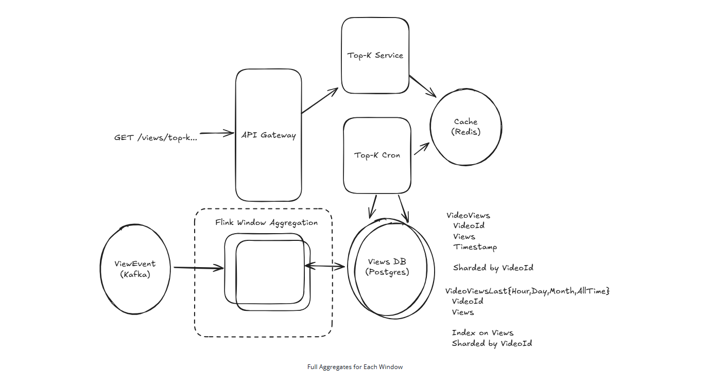

---

## 15. Design a News Aggregator

**Requirements**
- View aggregated feed from thousands of sources
- Infinite scroll
- Click article to redirect

**NFR**
- Availability
- Latency
- Scalability

**Entities:** User, Source / Publisher, Article

**Components**
- Collection Service: RSS feed parsing
- S3: Thumbnail storage
- Feed Service
- Cursor-based pagination: Article ID (ULID / Snowflake)
- Redis sorted set: Region-based feeds with CDC
- Intelligent scheduler: Fingerprint-based new content detection
- Web scraping + RSS + Publisher webhooks with fallback polling
- S3 + CDN
- Auto-scaling + cache replicas

**API**
```
GET /feed?page&region
```

**Data Models**
```
Article
  id
  title
  summary
  thumbnailUrl
  publishDate
  url
  hash

Publisher
  id
  name
  url
  rssFeedUrl
  lastScraped
  priority
  scrapedType
```


---

## 16. Design a Price Tracking Service

**Requirements**
- View price history for Amazon products
- Subscribe to price drop notifications

**NFR**
- Availability
- Latency
- Scalability
- Notification within 1 hour of price drop

**Entities:** Product, Price history, User, Subscription

**Components**
- Web crawler: Chrome for unviewed products, discover new products, verify suspicious data
- Price history service
- Subscription service
- Notification Cron
- Chrome extension: User-triggered price updates
- CDC → Kafka: Price change stream → notification workers (or dual write)
- TimescaleDB: Time-series extension for PostgreSQL

**API**
```
GET /products/{productId}/price?period&granularity
POST /subscriptions
{
  productId
  priceThreshold
  notificationType
}
```

**Data Models**
```
Product
  id
  amazonId
  lastScraped

Price
  id
  productId
  timestamp
  price

Subscription
  id
  userId
  productId
  priceThreshold
  notificationType
```


---

## 17. Design Online Auction

**Requirements**
- Create auction
- Bid (accept when higher than current highest)
- View bid history

**NFR**
- Strong consistency for bidding
- Fault-tolerant, durable
- Low latency for viewing auction bids
- Scalability

**Entities:** User, Auction, Item, Bid

**Components**
- Auction service + Bid service
- Optimistic locking: maxBidPrice as version in UPDATE WHERE clause
- Durable message queue: Bid processing
- SSE: Real-time updates for auction participants (pub/sub)
- SQS: Visibility timeout mechanism
- Push notifications: APNS / FCM

**API**
```
POST /auctions
{
  item, start, end
  startPrice
}
POST /auctions/{auctionId}/bids { bid }
GET /auctions/{auctionId}
```

**Data Models**
```
Auction
  id
  itemId
  startTime/endTime
  startPrice
  bidPrice
  status

Item
  id
  name
  description
  imageUrl

Bid
  id
  auctionId
  price
  userId
  status
  createdAt
```


---

## 18. Design WhatsApp

**Requirements**
- Create chat group
- Send / receive messages
- Offline message delivery
- Media sharing

**NFR**
- Availability
- Guaranteed deliverability
- Low latency
- Scalability
- Minimize centralized message storage

**Entities:** Users, Chats, Messages, Clients

**Components**
- WebSockets + L4 Load Balancer
- Chat server
- GSI (participant): PK = chatId
- Message Inbox: Per-client delivery queue
- Delivery flow: Send → ACK → Delete from inbox
- S3 / Block storage: Media files
- Pub/Sub: ChatId-based (at-most-once OK)
- Inbox-based on client

**API (WebSocket messages)**
```
createChat
sendMessage
createAttachment
add/removeChatParticipants
ack
chatUpdate
newMessage
```

**Data Models**
```
Chat
  id
  name
  metadata

Participant
  chatId
  participantId

Message
  id
  user
  chatId
  sentAt
  content

Inbox
  recipientClientId
  messageId

Client
  id
  userId
  type
```


---

## 19. Design Instagram

**Requirements**
- Create posts (photos, videos)
- Follow other users
- View chronological feed

**NFR**
- Availability
- Low latency
- Scalability

**Entities:** User, Post, Follow, Media

**Components**
- S3 / Block storage: Presigned URLs
- Fanout: On-read (cache, celebrity) vs on-write (precompute)
- Redis: Precomputed feed cache (sorted set)
- Redis Sentinel: HA
- AOF / RDB snapshots: Fault tolerance
- Chunked multipart upload
- S3 notifications: Server-side image processing
- CDN + Dynamic Media Optimization

**API**
```
POST /posts
{
  media (photo/video)
  caption
}
POST /follows { followerId }
GET /feed?cursor&page
```

**Data Models**
```
Post
  id (SK)
  media
  S3Link
  creator (PK)
  timestamp
  caption

Followers
  userId (PK)
  followedId (SK)
```


---

## 20. Design FB Post Search

**Requirements**
- Create and like posts
- Search posts by keywords
- Sort by recency or like count

**NFR**
- Availability
- Low latency
- Scalability
- New posts searchable < 1 min
- All posts must be discoverable

**Entities:** Post, Like, User

**Components**
- Ingestion Service: Inverted index creation
- Search Service
- Creation Index: List structure
- Like Index: Sorted set
- CDN + Redis: Search result caching
- Bigrams + Count-Min Sketch
- Kafka + Multiple ingestion services: Keyword-based index sharding
- Two-phase like indexing: Exponential write, keep 2*N, fresh data from Like Service
- Storage tiering: Hot (Redis) + Cold (S3)

**API**
```
POST /posts
POST /posts/{postId}/like
GET /search?query&sort_order (time, likes)
```

**Data Models**
```
Index Structure:
  keyword → postIds
  keyword → sortedSet(postId, likes)
```

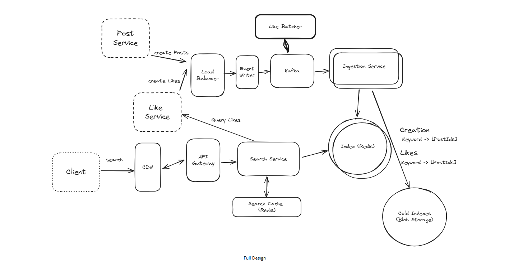

---

1## 21. Design Robinhood

**Requirements**
- View live stock prices
- Manage orders (create / cancel)

**NFR**
- Strong consistency for orders
- Low latency
- Scalability
- Efficiency

**Entities:** Symbol, Order, User

**Components**
- Symbol Price Processor + Cache + SSE
- Pub/Sub: Symbol-based subscriptions
- Order Service + Order Gateway + Trade Processor
- External Order Metadata DB
- Order consistency: Status tracking + cleanup job

**API**
```
GET /symbols/{name}
POST /orders
{
  position: buy|sell
  symbol
  quantity
  priceInCents
}
DELETE /orders/{orderId}
GET /orders
```

**Data Models**
```
Order
  id
  userId (partition key)
  symbol
  position
  quantity
  price
  state
  createdAt
  externalOrderId
```


---

## 22. Design Google Docs

**Requirements**
- Create document
- Multiple users edit same document
- View each other's changes
- See cursor positions

**NFR**
- Eventual consistency
- Low latency
- Scalability
- < 100 concurrent editors
- Document durability on server restart

**Entities:** User, Document, Edit, Cursor

**Components**
- WebSockets
- Doc metadata service
- Document service: S3 / block storage
- OT (Operational Transformation) or CRDTs (Conflict-free Replicated Data Types)
- Init flow: Read all Ops, WebSocket sends all applied Ops (Edits, not full doc)
- Client-side OT
- Cursor info: In-memory in doc service, sync via WebSocket
- Zookeeper + Consistent Hashing: Route users to same doc server per document ID
- Periodic snapshot / compaction: Optimize operation history

**API**
```
POST /docs { title }

WebSocket:
  insert
  update
  delete
  updateCursor
```

**Data Models**
```
Document
  id
  title

Operations
  timestamp
  docId
  data
```


---

## 23. Design Dropbox

**Requirements**
- Upload file from any device
- Download file
- Auto-sync across devices
- Share files with others

**NFR**
- Availability
- Latency (upload, download, sync)
- Scalability
- Large file support
- Security and reliability

**Entities:** File, FileMetadata, Chunk, User

**Components**
- S3 + File Metadata DB: S3 Notifications
- CDN: Download optimization
- Sync (Local → Remote): OS-specific events, local queue, last-write-wins
- Sync (Remote → Local): Polling (stale) + WebSocket / SSE (fresh)
- Chunked multipart upload + fingerprinting
- Smart compression
- Security: Transit (HTTPS), rest (S3 encryption), access control (shareList)
- Presigned URLs: User access with expiration

**API**
```
POST /files
{
  file
  fileMetadata
}
GET /files/{fileId}
POST /files/{fileId}/share
GET /files/{fileId}/changes
POST /files/presigned-url
```

**Data Models**
```
FileMetadata
  id
  name
  size
  type
  userId
  status
  S3URL
  chunks

SharedFile
  userId
  fileId
```


---

## 24. Design a Distributed Cache

**Requirements**
- get, set, delete operations
- TTL (Time-To-Live)
- LRU or LFU eviction

**NFR**
- Availability
- Latency (< 10ms)
- Scalability (1TB data, 100k QPS)

**Entities:** Key-values

**Components**
- HashMap + Doubly linked list: LRU implementation
- Cleanup process (Janitor): TTL enforcement
- HA options:
  - Leader + async replicas (simple)
  - Peer-to-peer / gossip (maximum availability)
- Sharding + Consistent hashing: Scalability
- Hot key handling:
  - Write: Key + salt, write batching
  - Read: Replicas / multiple copies
- Connection pooling

**API**
```
POST /{key} { value }
GET /{key}
DELETE /{key}
```


---

## 25. Design a Payment System

**Requirements**
- Initiate payment request
- Pay with credit / debit card
- View payment status

**NFR**
- High security
- Strong consistency
- Durability (no data loss)
- Scalability

**Entities:** Payment, Merchant, Transaction

**Components**
- Payment Service + Transaction Service
- Payment Gateway
- 1:N relationship: Payment (intention) → Transactions (attempts)
- Status flow: created → processing → succeeded / failed
- Webhooks: Server-to-server event notifications
- Security:
  - Auth: API Key, request signing, pub/private keys
  - PII protection: iframe isolation, JS SDK immediate encryption, HTTPS, non-reversible tokens
- Consistency:
  - Internal: Payment + Transaction in RDBMS / ACID
  - External: Event sourcing + reconciliation, rebuild from event log
- Storage: Cold storage (S3), read replicas
- Sharding: Merchant ID or time-based

**API**
```
POST /payments
{
  amountInCents
  currency
  description
}
POST /payments/{paymentId}/transactions
{
  type: payment
  card: { ... }
}
POST /{merchant_webhook_url}
{
  eventType
  paymentId
  status
}
```

**Data Models**
```
Payment
  id
  user
  merchantId
  amount
  currency
  description
  status

Transaction
  id
  paymentId
  amount
  type
  status
  payment network

Merchant
  id
  name
  API key
  metadata
```


---

## 26. Design TikTok / Douyin

**Requirements**
- Upload video (max 500MB)
- Browse feed (infinite scroll)
- Watch video (< 2s playback start)
- Like / comment

**NFR**
- DAU: 500M
- Playback start latency: < 2s
- Availability: 99.99%
- Read/Write ratio: ~1000:1 (read-heavy)

**Entities:** User, Video Metadata, Video File (S3), User→Video list (KV)

**Components**
- S3 + Presigned URL: Client direct upload, bypass App Server
- Message Queue: Async transcode trigger (decouple upload from transcode)
- Transcoding Service: Chunked parallel transcode → 360p/720p/1080p + HLS
- CDN + GeoDNS: Video delivery to nearest edge node
- Redis: Hot video metadata cache; Hot Key → Read Replicas
- Singleflight (Request Coalescing): Cache Stampede prevention
- KV Store: Denormalized `user_id → [video_id list]`, O(1) lookup
- Recommendation: Two-stage Recall (CF + Content-Based + Graph + Popularity) → Ranking (DNN, completion rate)
- ABR (Adaptive Bitrate): Dynamic quality switch based on bandwidth
- Prefetching: Pre-download N+1, N+2 chunks while watching N

**API**
```
POST /api/upload → Presigned URL
PUT /{presignedURL} (client direct to S3)
GET /api/feeds?cursor=&limit= → metadata + CDN streaming URL
```

**Data Models**
```
VideoMetadata
  video_id (shard key: hash)
  user_id
  status (processing/ready)
  url_360p / url_720p / url_1080p
  created_at

KV: user_id → [video_id list]
```

**Key Design Decisions**
- Shard key: `video_id` hash (not user_id → hot shard, not created_at → time hotspot)
- Eventual consistency: metadata DB + KV update via MQ (async, idempotent)
- Completion Rate (完播率) is the core recommendation signal, not likes

**Upload Pipeline**

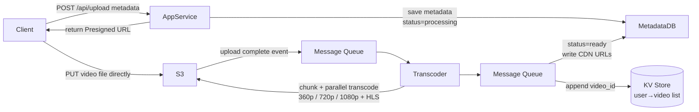

**Feed Playback**

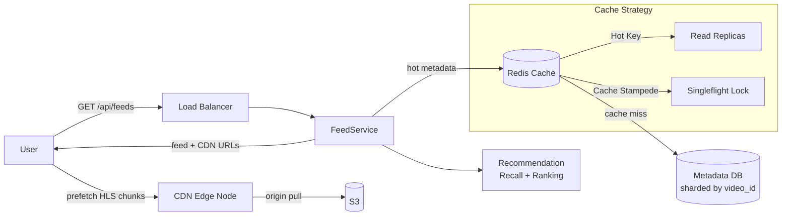

> Full deep dive: [[raw_material/tech/system-design/sd-douyin]]

---

## 27. Design ChatGPT

**Requirements**
- Send prompt → receive AI response (streamed)
- View past chats, resume with context carried across turns

**NFR**
- DAU: 200M; Peak: ~20k prompts/sec; Concurrent streams: ~120k
- TTFF (Time-to-First-Token): < 500ms
- Max generation time: ~30s
- Availability: 99.9%+ (availability > consistency for chat state)

**Entities:** User (tier: free/paid), Chat, Message (role: user/assistant, tokenCount), Generation (runId, status, inputTokens, outputTokens)

**Components**
- API Gateway: Auth (JWT, never userId in body), rate limiting
- Chat Service: Stateless, horizontal scaling; context assembly
- Postgres: Chats + Messages + Generations
- Job Queue: Decouple Chat Service from GPU Workers (Long-Running Tasks pattern)
- Inference Service: GPU Workers (model as black box)
- SSE (Server-Sent Events): One-way token streaming (not WebSocket — token flow is unidirectional)
- Redis Streams: Token fanout (XADD per token, XREAD blocking per Chat Service instance)
- Continuous Batching: Keep GPU full (vLLM/TGI); evict finished sequences, slot in queued ones
- Token-Aware Quota + Weighted Priority Queue: Fairness across users, priority across tiers (paid > free)
- Summarization: Compress history when approaching Context Window limit
- Prefix Caching (KV Cache reuse): Skip recomputing unchanged conversation prefix

**API**
```
POST /chats → { chatId }
POST /chats/{chatId}/messages → SSE stream (returns runId immediately)
GET /chats?cursor=&limit=
GET /chats/{chatId}/messages?cursor=&limit=
POST /chats/{chatId}/runs/{runId}/cancel
```

**Data Models**
```
Chat: chatId, userId, title, createdAt
Message: messageId, chatId, role, content, tokenCount
Generation: runId, chatId, messageId, status (queued/streaming/done/failed/cancelled),
            model, inputTokens, outputTokens
```

**Key Design Decisions**
- SSE not WebSocket: Token generation is unidirectional; SSE supports Last-Event-ID reconnect natively
- Redis Streams per runId: Fanout tokens from GPU Worker to any Chat Service instance holding SSE connection
- Close Tab ≠ Cancel: SSE reconnect replays from Last-Event-ID; cancel must be explicit POST /cancel
- GPU economics: 120k concurrent streams → tens of thousands of GPUs → ~$1.8B/year; every optimization matters
- Continuous Batching: GPU is memory-bandwidth bound; batch sequences together to amortize weight loading

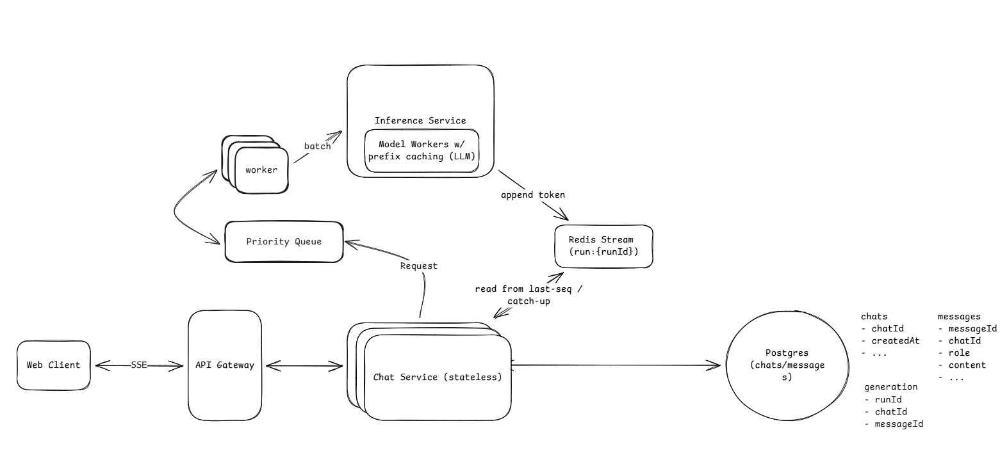

> Full deep dive: [[raw_material/tech/system-design/sd-chatgpt]]

---

## 28. Design Metrics Monitoring Platform

**Requirements**
- Ingest metrics (CPU, memory, latency, custom counters) from services
- Query and visualize metrics on dashboards (filter, aggregate, time range)
- Define alert rules with thresholds over time windows
- Receive notifications when alerts fire (Slack, PagerDuty, email)

**NFR**
- Scale: 500k servers → **5M metrics/sec**, ~1GB/sec raw ingestion
- Dashboard query latency: **seconds** (even across days/weeks)
- Alert latency: **< 1 minute** from metric emission to alert firing
- High availability; dashboards tolerate eventual consistency; alerts must be reliable
- Handle out-of-order data gracefully

**Entities:** Label (key-value), Metric (name + labels + value + timestamp), Series (unique metric+label combo over time), Alert Rule (query + threshold + duration), Dashboard

**Components**
- Agent: Per-server local aggregation (10s batches) before shipping — reduces request count by orders of magnitude
- Kafka: Decouple ingestion rate from storage write rate; absorbs spikes; enables replay
- Ingestion Service: Validate, enforce cardinality policy, batch write to TSDB
- Time-Series DB (InfluxDB / VictoriaMetrics): LSM Tree + columnar compression + time partitioning; orders of magnitude faster than Postgres for this workload
- Query Service: Parse PromQL-like DSL, fan out to TSDB, format results; physically separate from write path
- Rollup / Downsampling: Pre-aggregate to 1min / 1h / 1day — long-range queries scan thousands not billions of points
- Alert Evaluator: Periodic polling (every 30-60s) against Query Service — "alerts are just scheduled queries" (Prometheus Alertmanager pattern)
- Notification Service: Deduplication (state transition only), Grouping (one page per cluster not per server), Silencing, Escalation
- Cardinality Tracker (Redis): SET membership check per Series; enforce per-metric Series cap
- Policy Store (Postgres): Label allowlist + Series cap per metric name

**API**
```
POST /metrics/ingest  { metrics: [{name, labels, value, timestamp}] }
  → Protobuf in production (not JSON at 1GB/sec)

GET /metrics/query?query=avg(cpu_usage{region="us-east"})&start=A&end=B&step=60

POST /alerts/rules  { name, query, for: "5m", notifications: [...] }
```

**Key Design Decisions**
- Kafka Catch-up tradeoff: queue absorbs failures but creates catch-up debt; most systems prefer dropping data over falling persistently behind
- TSDB not Postgres: B-Tree indexes are wrong for time-range scans; TSDB columnar compression achieves 10:1 on time-series data
- Polling not Flink for alerts: 1-min NFR satisfied by polling; Flink only if interviewer explicitly asks for sub-second alerting
- Cardinality explosion: every unique metric+label combo = 1 Series; unchecked labels can explode to 50M+ Series → write perf collapse + query OOM
- Meta-monitoring trap: never monitor the monitoring system with itself — use independent external probes

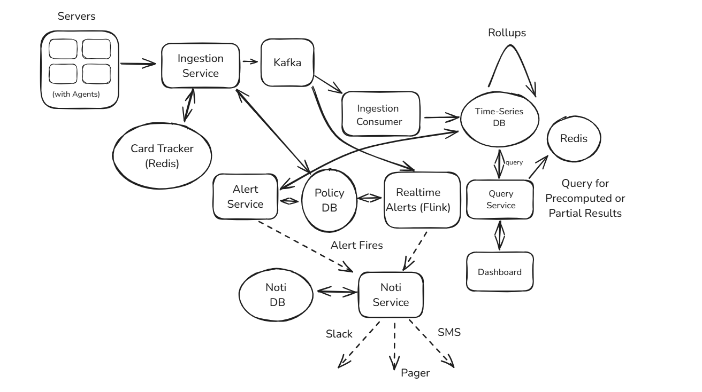

> Full deep dive: [[raw_material/tech/system-design/sd-metrics-monitoring]]

---

## 29. Design Video Moderation System

**Requirements**
- Ingest video uploads and evaluate for policy compliance in near real-time
- Safety operators can create, test, and roll out rule-based policies without redeploying
- Auto-enforce violations (remove, age-gate, geo-block, escalate to human review) + notify
- Complete audit trail per decision: model versions, scores, rules fired, actions taken

**NFR**
- End-to-end latency: **P95 < 5s** (upload → first decision)
- Scale: millions of videos/day (~50 videos/sec avg, higher peaks)
- Availability: 99.9%+; **Fail Safe** (hold content, not pass-through) on failure
- Idempotency: retries must not cause duplicate removals or notifications
- Audit retention: years (legal compliance)
- Data residency: regional data locality (GDPR, local regulations)

**Entities:** Video, ModerationJob, MLScore (model_id + version + score + category), PolicyRule (versioned, status: draft/shadow/canary/global), ModerationDecision (action + scores_snapshot + rule_fired), AuditEvent (append-only, immutable), HumanReviewTask

**Components**
- Kafka: Decouple upload from moderation pipeline; each stage independently scalable
- Frame Extractor: Keyframe sampling — don't process every frame
- Lightweight Classifier (CPU): Fast pass over all videos; 70-80% resolved here without GPU
- Heavy GPU Models (parallel): Nudity / Violence / Hate / Copyright — only for risky content
- Cascaded Inference: Lightweight first → only high-risk escalates to GPU; P0 fast path for high-risk creators/new accounts
- Rule Engine: Externalized DSL policy store (Postgres); runtime load — no redeploy needed; Draft→Shadow→Canary→Global lifecycle
- Shadow Mode: New rules execute but produce no real actions; simulate on historical traffic before canary
- Action Service: Remove / Age-gate / Geo-block / Escalate — all idempotent via decision_id key
- Saga Pattern: Multi-step distributed actions (DB + CDN purge + notify + audit) with compensation on failure
- Audit Log: Append-only (ClickHouse / S3), includes model_hash + rule_version + scores; Write-once (S3 Object Lock)
- Human Review Queue: Priority-ordered; SLA deadline per task; appeal triggers Saga compensation

**API**
```
POST /moderation/jobs          → trigger job (idempotent: video_id as key)
GET  /moderation/jobs/{jobId}  → poll status
GET  /moderation/videos/{id}/audit → full audit trail
POST /policies/rules           → create rule (starts as draft)
PATCH /policies/rules/{id}/status → advance: draft→shadow→canary→global
POST /policies/rules/{id}/simulate → dry-run against historical traffic
POST /moderation/decisions/{id}/appeal → trigger human review + Saga compensation
```

**Key Design Decisions**
- Fail Safe not Fail Open: GPU failure → fall back to lightweight + human review, never auto-approve
- Cascaded inference: 70-80% of uploads safe → CPU-only; GPU reserved for risky tail
- Latency budget per stage: Frame 500ms / Lightweight 500ms / GPU 2s / Rules 200ms / Action 300ms = P95 5s
- Rule engine Shadow Mode: validate false positive rate before canary; Safety team can iterate without engineering
- Idempotency via decision_id: At-least-once Kafka delivery won't cause duplicate takedowns
- Deterministic evaluation: freeze model_version + rule_version + scores at decision time → fully replayable audit
- Data residency: hot path (ingest + inference + rules) regional; cold path (decision summaries) async replicated

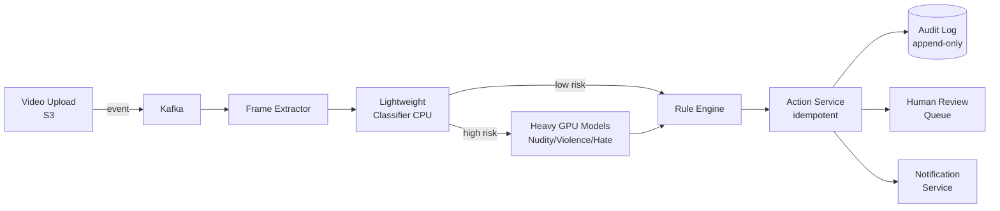

> Full deep dive: [[raw_material/tech/system-design/sd-video-moderation]]
